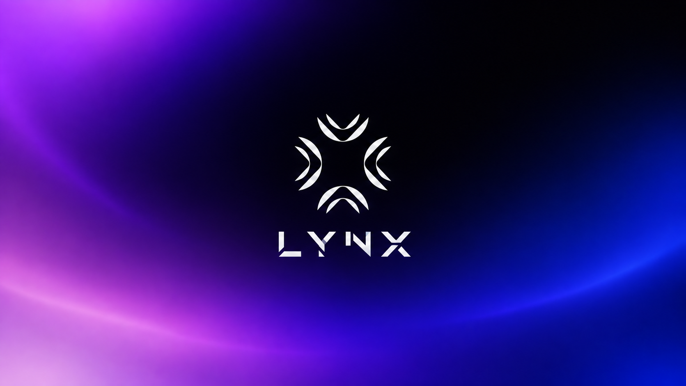

<div align="center">



**An independent, privacy-focused web search engine by [Anoneurx](https://anoneurx.com)**

`fast discovery · no tracking · open infrastructure`

[](#)
[](./LICENSE)
[](./docs/architecture.md)

</div>

---

## What LYNX is

LYNX is a search engine built the way we would want one built: fast, inspectable, and
hostile to surveillance. It crawls the public web under `robots.txt`, indexes what it is
allowed to index, and serves results without building a profile of who asked what.

> **Design phase.** This repository currently contains the complete architecture,
> threat model, data model, and engineering plan for LYNX. There is no running search
> engine here yet. Production code is written against these documents, not before them.

## Design principles

| # | Principle | Consequence in the code |
| - | --------- | ----------------------- |
| 1 | **Privacy is structural** | No query logs, no cookies, no fingerprinting, no third-party assets. See [PRIVACY.md](./PRIVACY.md). |
| 2 | **The web is untrusted input** | Every crawled byte is hostile-by-default: SSRF-safe fetch layer, no HTML execution, size/time caps. |
| 3 | **Ranking must be explainable** | Versioned, inspectable signal weights. No opaque black box. |
| 4 | **No premature distribution** | Modular monolith + worker processes. Swappable index. Scales without rewrites. |
| 5 | **Honest claims only** | Targets are labelled as targets. Limitations are documented, not hidden. |
| 6 | **Reproducible by default** | Locked toolchains, hermetic containers, pinned digests, SBOMs. |

## Repository map

```text
lynx/
├── apps/            Deployable applications: web UI, public API, admin console
├── services/        Backend workloads: crawler, frontier, parser, indexer, ranker, query, suggestions, ai
├── packages/        Shared internal libraries: models, config, logging, security primitives
├── database/        Migrations, schema notes, seed data
├── infrastructure/  Docker, Kubernetes, Terraform, monitoring definitions
├── research/        Experiments, benchmarks, datasets, papers, reports
├── config/          Layered TOML configuration (no secrets)
├── scripts/         Developer tooling
├── tests/           Cross-cutting test suites (unit, integration, e2e, security, perf)
└── docs/            All design documentation, ADRs, ERDs, diagrams
```

Every directory has a `README.md` explaining its purpose. Start with
[ARCHITECTURE.md](./docs/architecture.md) for the system view and
[docs/architecture/specification.md](./docs/architecture/specification.md) for the
complete specification.

## Documentation map

| I want to... | Read |
| ------------ | ---- |
| Understand the whole system | [ARCHITECTURE.md](./docs/architecture.md), [docs/architecture/specification.md](./docs/architecture/specification.md) |
| See the data model | [docs/database/erd.md](./docs/database/erd.md) |
| Understand crawling & SSRF defence | [docs/crawler/](./docs/crawler/overview.md), [docs/security/ssrf-defense.md](./docs/security/ssrf-defense.md) |
| Understand ranking maths | [docs/ranking/](./docs/ranking/overview.md) |
| Understand the query language | [docs/search/query-language.md](./docs/search/query-language.md) |
| Understand the privacy model | [PRIVACY.md](./PRIVACY.md), [docs/privacy/](./docs/privacy/model.md) |
| Attack the design | [THREAT_MODEL.md](./docs/threat-model.md) |
| Ship it safely | [SECURITY.md](./SECURITY.md), [docs/security/](./docs/security/architecture.md) |
| Use the API | [API.md](./API.md) |
| Run it locally | [DEVELOPMENT.md](./DEVELOPMENT.md) |
| Operate it | [DEPLOYMENT.md](./DEPLOYMENT.md), [docs/operations/](./docs/operations/observability.md) |
| Know why a decision was made | [docs/adr/](./docs/adr/README.md) |
| Know what is next | [ROADMAP.md](./ROADMAP.md) |

## Honest limitations

LYNX does not claim anonymity, and it is not "zero logs". See
[docs/privacy/limitations.md](./docs/privacy/limitations.md) for the full statement:

- Operators, hosting providers, and network intermediaries can observe infrastructure-level logs.
- A query is shared with the destination site when a user clicks a result.
- HTTP-level metadata (TLS SNI, connection reuse, IP) can leak coarse timing and network info.
- The index is small compared to commercial engines for years. Coverage will be worse.

What LYNX *does* commit to: we do not build a profile of you, we do not sell or share
query data, and we document every place we store something.

## Status

| Phase | State |
| ----- | ----- |
| Phase 0 — Architecture & planning | **in progress** |
| Phase 1 — Search prototype | not started |
| Phase 2 — Crawler | not started |
| Phase 3 — Real search engine | not started |
| Phase 4 — Privacy hardening | not started |
| Phase 5 — Astra (AI answers) | not started |
| Phase 6 — Scale & distribution | not started |

## Contributing

Issues, labels, milestones, and review requirements are documented in
[CONTRIBUTING.md](./CONTRIBUTING.md). Security issues go through
[SECURITY.md](./SECURITY.md) — not through public issues.

## License

Source is AGPL-3.0-or-later so that anyone running a modified LYNX as a service must
publish their changes. Commercial licensing is available from Anoneurx.
See [LICENSE](./LICENSE) and [docs/privacy/legal.md](./docs/privacy/legal.md).