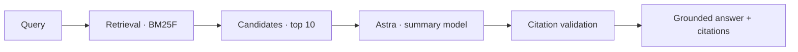

# AI — Astra and optional generation

AI in LYNX is strictly secondary. The core is search (ranking and lexical retrieval); Astra is an
optional summary layer that runs over the retrieved corpus without access to external tools,
user state, or query logs.



| Document | Contents |
| -------- | -------- |
| [README.md](./README.md) | This overview |
| [astra.md](./astra.md) | The model layer, self-hosting, grounding, constraints |
| [evaluation.md](./evaluation.md) | How summary quality is judged |
| [safety.md](./safety.md) | Prompt injection defence, refusal handling |

## Principles

1. **Retrieval before generation.** Astra summarizes what was found; it does not generate from
   parametric memory. If a fact is not in the retrieved snippets, it does not exist.
2. **Zero tool use.** The model has no fetch function, no web search, no file access, and no
   database connection. Its only input is the text provided by the search retrieval step.
3. **Strict citations.** Every factual claim must carry a citation pointing to a retrieved `doc_id`.
   Uncited claims are dropped by the validation layer before rendering.
4. **No query logging.** Queries sent to Astra are ephemeral, unpersisted, and never logged.
5. **Completely optional.** If Astra is disabled, down, or slow, search works identically without
   it.

## The summary contract

```json
{
  "summary": "Tokio is a multi-threaded asynchronous runtime for Rust [1]. It provides a scheduler, timer facilities, and an I/O driver [1][2].",
  "citations": [
    { "id": 1, "doc_id": "01JX8QK2M9F4T7YB3W5N6P8R0SV", "url": "https://tokio.rs/", "title": "Tokio" },
    { "id": 2, "doc_id": "01JX8QK3N2H8V4W9Y1P7M6Q2DX", "url": "https://tokio.rs/docs", "title": "Documentation" }
  ]
}
```

If the retrieved candidates do not contain enough information to answer the question, Astra emits:
`"The retrieved sources do not contain enough information to answer this question."`
It is programmed never to extrapolate or fill gaps from training data.

## Why this design

Most search engines use AI to replace search or to personalize results. LYNX uses AI as a
paragraph condenser over the top search results, with strict bounds:

- **No hallucination buffer:** By tying every sentence to a retrieved `doc_id` and validating it,
  we eliminate ungrounded text.
- **No data leakage:** Because Tantivy returns only public web snippets and Postgres holds no
  user data, Astra has no access to sensitive information even if compromised.
- **Low latency budget:** Astra runs locally on self-hosted hardware (or a dedicated cluster) with
  quantised models (e.g., Llama-3-8B-Instruct or equivalent), bounded to max 256 tokens output,
  adding under 150 ms to p95 when enabled.

## Configuration

```toml
[ai.astra]
enabled = false
model = "meta-llama/Llama-3-8B-Instruct"
endpoint = "http://localhost:8080/v1"
max_tokens = 256
temperature = 0.0
timeout_ms = 200
```

Default is `enabled = false`. An installation of LYNX is a complete, fully functioning search
engine without running any AI model.