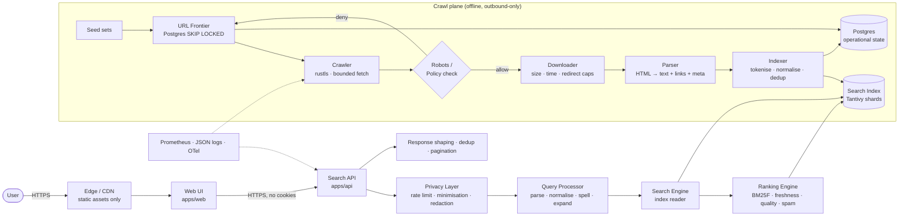
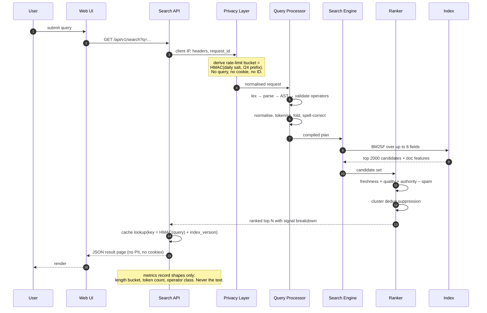
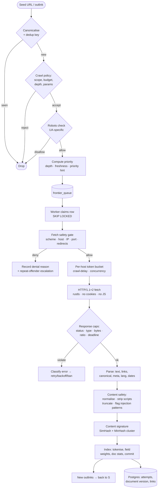
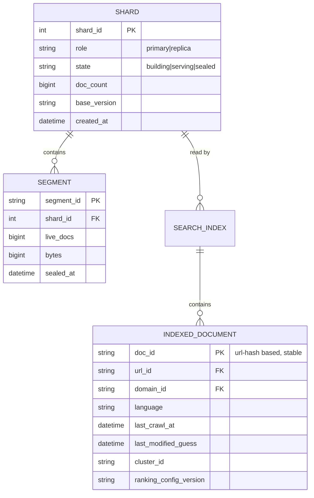
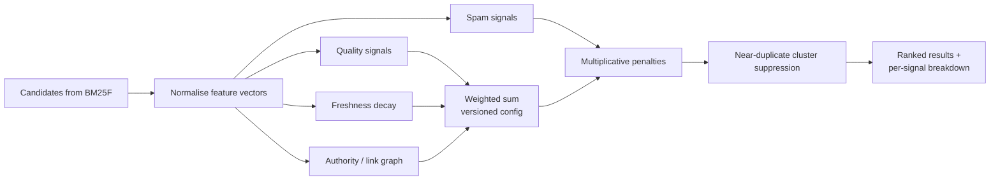
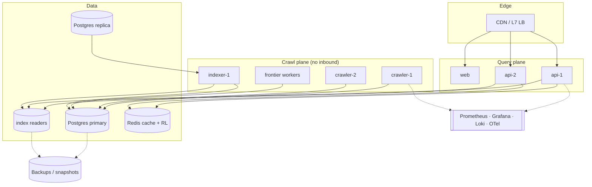

# LYNX Architecture

> The short version. The long version is
> [docs/architecture/specification.md](./architecture/specification.md).

## 1. System context

Two planes, deliberately separated:

- **Query plane** — internet-facing, read-only over the index, no outbound network access.
- **Crawl plane** — outbound-only, never internet-facing, holds the only code that touches
  untrusted web content. It cannot read user requests.

Compromise of the crawl plane does not become a query-log compromise, because the crawl
plane never has access to query data.

## 2. Component responsibilities

| Component | Repo path | Responsibility | Scaling axis |
| --------- | --------- | -------------- | ------------ |
| Web UI | `apps/web` | React SPA, SSG for static pages, privacy-preserving SERP | CDN, static |
| Admin console | `apps/admin` | Private ops dashboard, never public | Behind VPN/SSO |
| Search API | `apps/api` | axum HTTP edge, auth, rate limits, response assembly | Horizontal, stateless |
| Privacy layer | `packages/security` + `services/api` middleware | IP-prefix bucket hashing, daily salt rotation, header policy, redaction | In-process |
| Query processor | `services/query` | Lexer, parser, AST, operators, spell correction, expansion | CPU-bound, shardable |
| Ranking engine | `services/ranker` | Feature extraction, weighted scoring, dedup, penalties | CPU-bound, shardable |
| Search index | `services/indexer` (writer) / `apps/api` (reader) | Tantivy shards, commit policy, snapshots | Shards × replicas |
| URL frontier | `services/frontier` | Priority queue, dedup, scheduling, budget accounting | Postgres contention → shards |
| Crawler | `services/crawler` | Fetch execution, SSRF policy, politeness, budgets | Horizontal, per-host caps |
| Parser | `services/parser` | HTML→text, links, canonical, metadata, language, dates | CPU-bound, batchable |
| Indexer | `services/indexer` | Normalise, tokenise, dedup, write documents, commit | Horizontal by doc id |
| Document store | `database/` (Postgres) | Extracted text + metadata per URL version | Partitioned |
| Metadata store | `database/` (Postgres) | Domains, robots, frontier state, link graph, ops | Partitioned |
| Suggestions | `services/suggestions` | Prefix→completion from term/document frequency | Read-only replica |
| Astra (AI) | `services/ai` | Retrieval-grounded answers with citations, optional | Isolated, rate limited |
| Monitoring | `infrastructure/monitoring` | Prometheus, Grafana, alert rules | Infra |

## 3. Data flow: a search

## 4. Data flow: a crawl

## 5. Search index shape

Index fields and weights are defined in
[docs/indexing/index-schema.md](./indexing/index-schema.md). Index technology choice
and its escape hatch are in [ADR-0002](./adr/0002-search-index.md).

## 6. Ranking pipeline

Every score is reproducible from `(doc_id, index_version, ranking_config_version)`.
Breakdowns are returned in debug mode and always internally, so ranking complaints are
answerable. See [docs/ranking/](./ranking/overview.md).

## 7. Deployment topology

The crawl plane runs on a separate network policy: **no ingress from the internet, egress
restricted to port 80/443 and DNS.** A compromised crawler host cannot be used as a pivot
into the query plane, and the query plane cannot be used to make the crawler fetch internal
addresses.

## 8. Key architectural decisions

| Decision | Choice | Why | ADR |
| -------- | ------ | --- | --- |
| Primary language | Rust | Untrusted-input safety, no GC latency, single binary | [0003](./adr/0003-primary-language.md) |
| Service shape | Modular monolith + workers | No premature microservices; independent scaling via process boundaries | [0001](./adr/0001-project-architecture.md) |
| Search index | Tantivy behind a trait | Rust-native, embeddable, BM25F; replaceable | [0002](./adr/0002-search-index.md) |
| Primary DB | PostgreSQL | Operational state needs relational integrity | [0004](./adr/0004-database.md) |
| Frontier queue | Postgres `SKIP LOCKED` | One less dependency; migrate to broker when measured | [0008](./adr/0008-frontier-queue.md) |
| Frontend | Vite + React + Tailwind | One component model, self-hosted assets | [0009](./adr/0009-frontend-rendering.md) |
| Ranking | Feature-based, versioned config | Explainability, reproducibility, safe A/B | [0010](./adr/0010-ranking-framework.md) |
| AI | Optional, isolated, retrieval-grounded | Never let generation replace retrieval | [0015](./adr/0015-ai-integration-boundary.md) |
| IDs | UUIDv7 | Time-ordered, index-friendly, non-enumerable | [0017](./adr/0017-identifier-strategy.md) |

## 9. What deliberately does not exist in v0.1

- No user accounts, no profiles, no history, no cookies, no fingerprinting.
- No advertising or bidding systems.
- No distributed index or cluster orchestration.
- No JavaScript execution in the crawler.
- No full-page HTML archive (extract and store text; see
  [ADR-0016](./adr/0016-content-storage-policy.md)).
- No agentic AI loop over untrusted content.

See [ROADMAP.md](../ROADMAP.md) for when each of these is reconsidered and why.