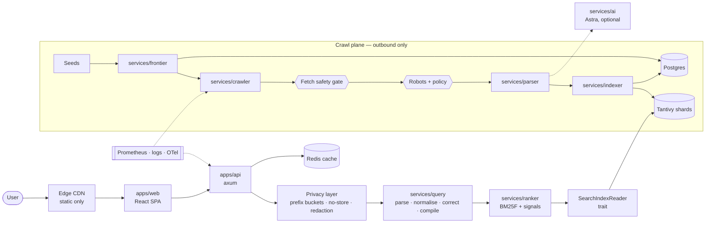
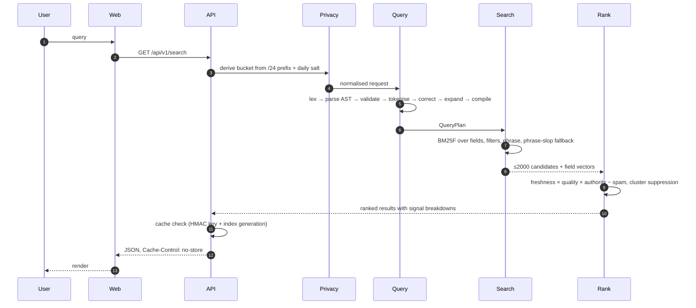
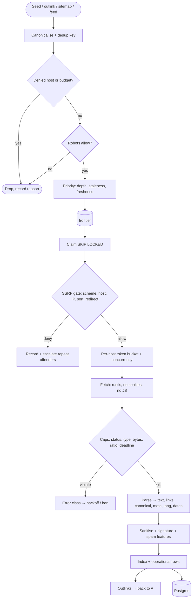
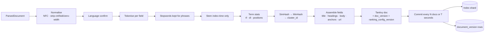
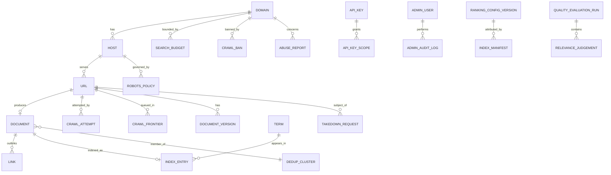

# LYNX Architecture Specification

> The complete, self-contained architecture for LYNX. Section order follows the project
> brief. This document is the reference; everything else is a detail view of it.
>
> **Status:** design stage. Last reviewed 2026-02-18. Owner: Anoneurx engineering.
> Companion documents: [architecture.md](../architecture.md) (summary),
> [threat-model.md](../threat-model.md), [PRIVACY.md](../../PRIVACY.md).

---

## 1. Vision

LYNX is an independent, privacy-focused web search engine built by Anoneurx. It crawls
the public web under site-declared rules, indexes what it is allowed to index, and serves
results without building a durable record of who searched what.

The vision is a search engine a user can reason about: a crawler that tells you what it
will fetch and why, a ranking function whose every signal is named and weighted, and a
privacy model that is legible enough to audit rather than a marketing page.

## 2. Goals

| # | Goal | Measurable target |
| - | ---- | ------------------ |
| G1 | Serve fast web search | p95 < 400 ms, p99 < 1 s at 10 M documents |
| G2 | Do not persist queries or profile users | No query text in any store; audited by CI test |
| G3 | Respect crawling boundaries | 100 % robots compliance; per-host budgets enforced independently |
| G4 | Never expose internal infrastructure through the crawler | Zero private-address sockets; fuzz + adversarial suite |
| G5 | Keep ranking explainable | Every result carries a full signal breakdown |
| G6 | Keep the index replaceable | One trait boundary; no Tantivy types in API or ranker |
| G7 | Scale components independently | Query and crawl planes scale separately |
| G8 | Ship AI answers without letting AI replace retrieval | Fail-closed citation verification; SERP always present |
| G9 | Be honest | Targets labelled as targets; limitations published |
| G10 | Be reproducible and safe to operate | Locked toolchains, signed images, tested RTO |

## 3. Non-goals

Explicitly **not** attempted, at least through Phase 5:

- Reproducing Google-scale infrastructure, coverage, or latency. LYNX will be a worse
  search engine for years and should not pretend otherwise.
- Global-scale crawling in v0.1. The design scales; the deployment does not need to yet.
- Advertising, bidding, sponsored results, affiliate placement, or any data brokerage.
- User accounts, search history, personalised results, or cross-session continuity.
- JavaScript execution in the crawler. No headless browser.
- Full-page HTML archiving or republication of third-party content.
- Absolute anonymity. That is a network property; see §13.6.
- Distributed infrastructure before single-node architecture is validated and measured.
- Replacing retrieval with generation. Astra summarises retrieval; it does not invent it.
- Zero logs at the infrastructure layer. See §13.7 for the honest statement.
- Mobile apps, browser extensions, or third-party integrations in v0.1.

---

## A. Executive Summary

**System shape.** LYNX is a modular monolith with worker processes, not a set of
microservices. A single `apps/api` binary serves search; `lynx-crawler` and
`lynx-indexer` do the offline work; a shared library tree holds domain logic. Services
that need to scale independently are separate binaries from day one, so separating them
later is a deployment change, not a rewrite.

**Two planes, one hard boundary.**

```text
QUERY PLANE (internet-facing, read-only)     CRAWL PLANE (outbound-only, no user data)
  web → api → query processor                 seeds → frontier → crawler → parser
       → index reader → ranker                     → safety gate → fetch → robots
                                                        → indexer → index
```

The query plane never touches untrusted web content. The crawl plane never sees a user
query. A compromise of one does not become a compromise of the other, and the network
policy enforces it independently of the code.

**Data.** PostgreSQL is the system of record for crawl state and governance. Tantivy is
the search index and is a *derived artifact* — rebuildable, snapshotted, and replaceable
behind the `SearchIndexReader` trait. Redis is a non-durable cache and rate-limit store.
Object storage holds backups and index snapshots.

**Privacy is structural.** No query text is persisted anywhere: not in Postgres, not in
Redis (cache keys are HMACs), not in logs (shape only), not in metrics (shapes only), not
in traces. Rate limiting uses a daily-rotating HMAC of the client's /24 or /48 prefix, so
it works without creating a trackable identity. The query string is parsed into an AST at
the handler boundary and the raw string is dropped, so there is nothing for a logger to
log. This is enforced by tests, not by discipline.

**Ranking** is BM25F plus five named signal families with versioned weights, multiplicative
spam penalties, and near-duplicate cluster suppression. Every served result retains its
signal vector, so any ranking question is answerable and any ranking change is reviewable
as a golden diff.

**Safety.** The crawler's SSRF gate validates scheme, host, resolved IP against a
deny-list, port, and redirect chain at every hop, pins DNS to the validated address, and
refuses anything unresolvable to a public address. Response caps cover bytes,
decompression ratio, and deadlines. Robots is a policy input, never a trust input.

**Order of work.** Query processor and index reader first, so search is real before the
crawler exists. Then the crawler, then quality and privacy hardening, then AI, then
distribution. See §W.

---

## B. Recommended technology stack

| Component | Technology | Reason |
| --------- | ---------- | ------ |
| Frontend | Vite + React 19 + TypeScript + Tailwind | One component model for web and admin; fast HMR; strict types; no framework lock-in at the SSR boundary since we need static + CSR only |
| Public API | Rust + axum + tower + tokio | Middleware composition is the whole privacy story (auth, limits, headers, redaction, cache). axum/tower gives that in-tree, unlike most alternatives |
| Admin API | Same binary, separate bind, guarded routes | Avoids a second auth stack to get wrong |
| Query processor | Rust (`services/query`) | Hot path, must be allocation-frugal and predictable |
| Ranker | Rust (`services/ranker`) | Runs per query on up to 2 000 candidates; needs to be fast and deterministic |
| Search index | Tantivy (behind `SearchIndexReader` trait) | Lucene-lineage quality, Rust-native, embeddable, no JVM; trait boundary keeps it replaceable |
| Crawler | Rust + reqwest/rustls + tokio | Untrusted-input handling in a memory-safe language is the single strongest argument for the whole stack |
| Parser | html5ever + a bounded extractor | Standards-correct HTML5 parsing; we add the limits |
| Indexer | Rust + Tantivy writer | Shares the index types with the reader |
| Database | PostgreSQL 16 | Relational integrity for URL/document/link graph; `SKIP LOCKED` for the queue; `pg_trgm` for fuzzy domain ops; JSONB for extensible crawl metadata |
| Queue | Postgres `FOR UPDATE SKIP LOCKED` | One fewer system to operate; migrate to a broker only when claim latency is measured to be a problem |
| Cache + rate limit | Redis 7, persistence **off** | Durable rate-limit state is itself a privacy liability; loss on restart is acceptable |
| Object storage | S3-compatible, SSE-KMS | Backups, index snapshots, durable docs |
| Monitoring | Prometheus + Grafana + Alertmanager + OTel | Vendor-neutral; no SaaS on the data path |
| Frontend hosting | Static CDN, first-party only | No third-party requests is a CSP rule, not an intention |
| AI (optional) | Pluggable provider; OpenAI-compatible interface | Keeps the answer layer replaceable and off by default |
| Repo tooling | Cargo workspace + pnpm workspaces + Make | Two ecosystems, one entry point |
| CI | GitHub Actions, pinned by SHA | PR checks, quality gates, signed images, manual production deploys |

**Why Rust for everything server-side.** The dominant server-side workload in LYNX is
parsing and fetching content that an attacker controls. In that workload, memory safety is
not a style preference — it is the elimination of an entire bug class, and the second
workload (per-query CPU work with a hard latency budget) benefits from predictable cost
with no GC pauses. Ecosystem gaps are real and worth naming: HTML parsing is adequate,
streaming HTTP is adequate, and machine learning tooling is weak — which is fine, because
v0.1 ranking is deliberately transparent rather than learned, and when learned ranking
arrives it will run in a separate service where Python tooling is acceptable.

**Where Rust is not used.** The frontend and admin console are TypeScript because the
ecosystem, accessibility primitives, and browser tooling are there. The one Python-shaped
need (evaluation harnesses, experiment glue) lives in `research/` and never ships.

---

## C. Repository structure

```text
lynx/
├── README.md  LICENSE  CONTRIBUTING.md  SECURITY.md  CODE_OF_CONDUCT.md
├── CHANGELOG.md  ROADMAP.md  PRIVACY.md  API.md  DEVELOPMENT.md  DEPLOYMENT.md
│
├── docs/
│   ├── architecture.md          ← system architecture (summary view)
│   ├── threat-model.md          ← formal threat model
│   ├── README.md                ← documentation map
│   ├── getting-started.md
│   ├── configuration.md
│   ├── architecture/            ← overview, data flows, specification
│   ├── crawler/                 ← overview, frontier, robots, downloader, parser, safety, politeness
│   ├── indexing/                ← overview, pipeline, tokenization, schema, dedup
│   ├── ranking/                 ← overview, bm25f, freshness, authority, quality, spam, explainability
│   ├── search/                  ← overview, query-language, operators, pipeline, retrieval, pagination
│   ├── privacy/                 ← model, data-inventory, retention, telemetry, limitations, legal
│   ├── security/                ← architecture, ssrf-defense, authentication, secrets,
│   │                              supply-chain, incident-response, headers
│   ├── api/                     ← rest, errors, rate-limits, openapi, versioning
│   ├── ai/                      ← overview, prompt-injection, grounding
│   ├── operations/              ← observability, runbooks, backups, disaster-recovery, capacity
│   ├── database/                ← erd, schema-notes, migrations, partitioning
│   ├── testing/                 ← strategy, quality-evaluation
│   ├── adr/                     ← 0001…0021
│   └── diagrams/                ← mermaid sources
│
├── apps/          web/ · api/ · admin/
├── services/      query/ · ranker/ · suggestions/ · frontier/ · parser/ · indexer/ · crawler/ · ai/
├── packages/      common/ · models/ · config/ · logging/ · security/
├── database/      migrations/ · schemas/ · seeds/
├── infrastructure/ docker/ · kubernetes/ · terraform/ · monitoring/
├── config/        example.toml · development.toml · production.toml
├── research/      experiments/ · datasets/ · benchmarks/ · papers/ · reports/
├── scripts/       developer tooling
├── tests/         unit/ · integration/ · e2e/ · crawler/ · ranking/ · security/ · performance/
├── .github/       workflows/ · ISSUE_TEMPLATE/ · pull_request_template.md
├── Cargo.toml  package.json  Makefile  docker-compose.yml  .env.example
└── LICENSE  SECURITY.md  PRIVACY.md  THREAT_MODEL.md → docs/threat-model.md
```

Every directory has a `README.md` stating its purpose, its runtime, and its rules.

---

## D. System architecture



Fuller diagrams: [architecture.md §3](../architecture.md#3-data-flow-a-search) (search),
[§4](../architecture.md#4-data-flow-a-crawl) (crawl),
[§7](../architecture.md#7-deployment-topology) (topology).

---

## E. Component responsibilities

| Component | Responsibility | Deliberately does **not** |
| --------- | -------------- | ------------------------ |
| `apps/web` | SERP rendering, theme, accessibility | Store queries, load third-party assets |
| `apps/api` | HTTP edge: auth, limits, headers, cache, response assembly | Crawl, write to the index, log queries |
| `packages/security` | Bucket derivation, key hashing, headers, blocklists | Make policy decisions about crawling |
| `packages/config` | Layering, validation, secret references, fingerprint | Hold secrets |
| `packages/logging` | JSON logs, shape-only fields, sampling | Accept a query string |
| `services/query` | Lex, parse, validate, normalise, correct, expand | Execute fetches, touch the network |
| `services/ranker` | Score, dedup, explain | Write to the index, fetch |
| `services/indexer` | Normalise, tokenise, dedup, write documents, commit | Serve queries, see user data |
| `services/frontier` | Discovery, priority, dedup, budgets, scheduling | Fetch anything |
| `services/crawler` | Fetch, SSRF gate, robots, caps, politeness | Render content, follow a redirect without re-validating |
| `services/parser` | HTML → text/links/metadata, sanitise, fingerprints | Execute scripts, store raw HTML |
| `services/suggestions` | Corpus-derived completions | Derive from query logs |
| `services/ai` | Grounded answers with verified citations | Generate uncited claims, call tools |
| Postgres | Crawl state, documents, link graph, governance | Hold query data |
| Redis | Response cache, rate-limit counters | Persist anything |
| Tantivy | Inverted index, retrieval, highlighting | Be a system of record |

---

## F. Search request flow



| Step | Failure behaviour | Budget |
| ---- | ----------------- | ------ |
| Validate length/tokens | `INVALID_QUERY` / `QUERY_TOO_LONG` | < 1 ms |
| Parse operators | `UNSUPPORTED_OPERATOR`, never silent reinterpretation | < 1 ms |
| Normalise + correct | Correction below confidence threshold is skipped | < 5 ms |
| Compile | Internal failure → `UPSTREAM_UNAVAILABLE` | < 2 ms |
| Retrieve | Index unavailable → `INDEX_UNAVAILABLE` (SERP unavailable, not degraded silently) | 20–150 ms |
| Rank | Pure CPU, no I/O; panic-freedom required | 10–80 ms |
| Cache | Lookup failure is a miss, never an error | < 5 ms |
| Respond | Total server budget `api.request_timeout_ms = 3000` | — |

Caching: Redis, key `HMAC(cache_salt, canonical_query)` + filter set + **index generation**.
A new generation invalidates everything atomically. `Sec-GPC: 1` skips the cache. Cache
holds public results under hashed keys — the query itself is not recoverable.

Pagination: cursor-based (`next_cursor`), stable under a moving index, because offset
pagination silently skips and repeats results while the crawler commits.

Result limits: default 10, max 50 per page, 2 000 candidates before ranking.

---

## G. Crawling flow



Politeness is a hard requirement, not a nicety:

| Rule | Default | Source |
| ---- | ------- | ------ |
| `robots.txt` compliance | Always | Site policy; failure mode is documented in [crawler/robots.md](../crawler/robots.md) |
| Crawl-delay | Honour `*` and our group, use the larger | Site policy |
| Per-host concurrency | 2 | Politeness + our load on the origin |
| Per-host pages/day | 5 000 | Budget |
| Per-host bytes/day | 5 GiB | Budget |
| Min inter-request delay | 1 000 ms | Politeness |
| Backoff on 429/5xx | Exponential + `Retry-After` | Politeness |
| Ban on repeated failure | Escalating cooldown | Operational necessity |

---

## H. Indexing flow



Data structures: `doc_id` (UUIDv7, derived from the canonical URL so re-crawls update in
place), `term_id` (dictionary-assigned int32 within a shard), posting lists with
positions and per-field term frequencies, document length per field, field boosts,
positions for phrase queries, and a `cluster_id` for near-duplicate suppression.

Field weights are in [indexing/index-schema.md](../indexing/index-schema.md); dedup in
[indexing/dedup.md](../indexing/dedup.md).

---

## I. Ranking architecture

```text
Candidate retrieval (BM25F, ≤2000)
  → BM25F score per field, IDF from corpus statistics
  → freshness (crawl recency + publication decay)
  → quality (title, canonical, https, meta, depth, media)
  → authority (PageRank over the link graph, domain-capped)
  → context (domain match, language match, operator intent)
  → spam penalties (multiplicative, never additive-only)
  → near-duplicate cluster suppression
  → final score + full signal vector retained
```

Aggregation:

```text
score(d) = Σ_f  w_f · bm25f_f(d, q)                    lexical
         + w_fresh · freshness(d)                      freshness
         + w_quality · quality(d)                      quality
         + w_auth · authority(d)                       authority
         + w_context · context(d, q)                   context
score(d) × (1 − clamp(spam(d), 0, 1) · w_penalty)    spam (multiplicative)
score(d) × dup_penalty(cluster(d))                    near-duplicate suppression
```

Full derivations, per-signal ranges, and why each weight has its value:
[ranking/](../ranking/README.md). Explainability contract: [ranking/explainability.md](../ranking/explainability.md).

---

## J. Database architecture

PostgreSQL 16 as the system of record; Tantivy as a derived index; Redis as a
non-durable cache.

Design rules that shape the schema:

1. **A table that cannot be assigned a retention class does not get created.**
2. **No table can hold a search query.** There is no shape in which a user's search is
   recorded. This is a schema-level guarantee, not an application convention.
3. **`document` is current state; `document_version` is history.** Only the newest version
   is indexed.
4. **`link` is a real edge table**, because authority and duplicate detection both need the
   graph, and deriving it from the index would mix derived and source data.
5. **Hot tables are partitioned** — `crawl_attempt` and `link` by time/hash, so retention
   and vacuum are predictable.
6. **Logical references instead of FKs** on three hot paths (frontier→url, attempt→url,
   document→url) to avoid write amplification; integrity is enforced by a reconciliation
   job. Every other relation has a real FK.
7. **Expand/contract migrations** so rolling deploys never see a half-applied schema.
8. **One role per service.** The crawler cannot write `admin_audit_log`; the API cannot
   write `crawl_frontier`.

---

## K. ERD

The complete ERD is in [database/erd.md](../database/erd.md) — 30+ entities with
relationships, retention classes, and the privacy annotations. Condensed view:



Naming: uppercase snake_case tables, snake_case columns, `uuid` v7 primary keys,
`text` for URLs (with hash indexes where needed), `timestamptz` for all times,
Postgres enums for closed sets. Every table declares a retention class.

---

## L. API architecture

```text
GET  /api/v1/search                public search
GET  /api/v1/suggestions           public, debounced client-side
GET  /api/v1/status                index freshness + health
GET  /api/v1/documents/{doc_id}    public metadata for an opaque id
GET  /api/v1/explain               ranking breakdown (operator-only in v0.1)
POST /api/v1/keys                  create an API key (developer auth)
GET  /api/v1/keys                  list keys
DELETE /api/v1/keys/{id}           revoke
*    /api/v1/admin/*               operational APIs (VPN + SSO)
GET  /healthz  /readyz  /metrics   operational endpoints, not public API
```

Conventions: JSON only; cursor pagination; the standard error envelope with `request_id`;
`X-Request-Id` on every response; rate-limit headers; OpenAPI 3.1 as the source of truth,
generated types from it. Rate limits: anonymous 30/min per rotating /24 bucket,
developer 300/min per key. Auth: public endpoints need none; developer endpoints need
`Authorization: Bearer lnx_…`; admin needs SSO behind VPN.

Full contract: [API.md](../../API.md) and [api/](../api/README.md).

---

## M. Frontend architecture

Routes: `/`, `/search`, `/about`, `/privacy`, `/docs`, `/status`, `/about/operators`.
Rendering: prerendered static pages, client-side `/search`. The URL is the source of truth
for query and filters so results are shareable and back-navigable.

Principles: minimal, fast, accessible (WCAG 2.2 AA), responsive, keyboard-complete,
`prefers-reduced-motion` honoured, system + manual theme, no cookies, no third-party
requests, no fingerprinting, self-hosted fonts, strict CSP with no `unsafe-inline`.

Distinct identity, not a recoloured Google: a type-forward editorial layout, a dense
scannable result block, and a deliberate accent rather than the default link blue.

---

## N. Privacy architecture

Five rules, four mechanisms, one test suite.

1. **Query non-persistence.** The query string is parsed into an AST at the handler edge
   and dropped. It cannot be logged because it is not held where a logger can reach it.
2. **Cache keys are HMACs**, so cached responses cannot be reversed into queries.
3. **Rate limiting without identity** via `HMAC(HMAC(secret, date), /24 prefix)`, 25 h TTL,
   memory-only store. Buckets rotate daily, so there is nothing durable to correlate.
4. **Shape-only telemetry** — length bucket, token count, operator classes. Never text.
5. **No third-party requests**, enforced by CSP and asserted by an E2E test.

Plus: no cookies or client storage identifiers, no accounts, field-level encryption for the
only personal data (abuse reports, API-key owner email), a documented retention per table,
admin actions audited, backups encrypted with a 35-day ceiling, and a purge path for
takedowns and erasure.

Limits of this model: NAT and VPN users share buckets; coarse timing correlation is still
possible at the network layer; the crawler's corpus contains third-party personal data and
is handled accordingly; infrastructure logs outside our control exist and are disclosed.

Full statement: [PRIVACY.md](../../PRIVACY.md) and [privacy/](../privacy/README.md).

---

## O. Threat model

35 threats across external attackers, malicious sites, infrastructure compromise,
privacy, and availability, each with impact, likelihood, mitigation, and residual risk, plus
explicit out-of-scope items and a risk register.

Highest residual risks, stated plainly: rate-limit evasion across prefixes (cost, not
privacy), novel spam and novel prompt-injection techniques (degrade ranking or disable
answers, do not break search), DNS/application proxies the crawler cannot see, and
provider-level log access outside our control.

Full model: [threat-model.md](../threat-model.md).

---

## P. Security architecture

Controls by layer:

- **Transport** — TLS 1.3, HSTS preloaded, internal TLS/mTLS.
- **Edge** — CDN for static assets only, path-only access logs, body size limits.
- **Application** — strict CSP, `nosniff`, `no-referrer`, `frame-ancestors 'none'`,
  `Permissions-Policy` minimised, CORS first-party allowlist, trusted-proxy depth pinned.
- **Auth** — no auth for search; hashed API keys for developer endpoints; VPN + SSO + MFA
  for admin; dual-control break-glass; full audit trail.
- **Secrets** — never in git, images, config files, or logs; secret references only;
  `SecretString` with zeroise; rotation schedule; external secrets operator in k8s.
- **Crawl safety** — the SSRF gate of §G and [security/ssrf-defense.md](../security/ssrf-defense.md).
- **Input validation** — allowlist validation, bounded lengths, `deny_unknown_fields`,
  no user regex, bounded allocation on every untrusted path.
- **Supply chain** — pinned digests, SBOM, cosign, Trivy, `cargo-deny`, `cargo-audit`,
  gitleaks, pinned CI actions, OIDC deploys, no self-hosted runners on fork PRs.
- **Response headers** — the exact set in [security/headers.md](../security/headers.md),
  asserted in tests.

Incident response: documented runbooks for API abuse, index tampering, secret exposure,
SSRF probing, and takedown floods, with severity definitions and a post-incident
ADR requirement.

---

## Q. AI / Astra integration architecture

```text
query → normal search (unchanged, always computed first, always cached)
      → top-K (8–12) already-ranked, deduplicated results
      → per-source passage extraction with provenance offsets
      → prompt assembly: system prompt + strict delimiters + numbered sources
      → one model call, structured output, no tools, no memory, no agent loop
      → verifier: every claim ↔ citation ↔ source span; numeric consistency check
      → pass: answer + citations + the SERP itself
        fail: no answer, SERP only (fail closed)
```

Controls: bounded context (6 000 tokens default), daily token budget, per-bucket rate
limit, answer cache with hashed keys and 600 s TTL, circuit breaker, kill switch, and a
separate binary with network access limited to one model endpoint.

Prompt-injection defences, since crawled pages are hostile by assumption: content confined
to an explicitly-labelled data channel with delimiters; instructions separated from data at
the API level; system prompt not derivable from content; no tool use; output schema
validation; URL allowlist on generated output; unicode normalisation before the model sees
anything (zero-width, bidi, homoglyph); per-source truncation that preserves provenance;
retrieval-time trust scoring that can exclude low-trust sources from the AI context; and a
documented rule that **no** defensive measure lets page content override system
instructions, because the architecture — not the prompt — makes that true.

Designated threats and full mitigations: [ai/prompt-injection.md](../ai/prompt-injection.md).

---

## R. Observability

**Metrics.** Prometheus histograms for search/crawl latency; counters for requests, results,
cache hits, fetch outcomes by class, indexed documents, queue depth, denials by reason,
commit duration. Cardinality is bounded by rule: no query, URL, document id, or IP may
ever be a label. This is a privacy control as much as a cost control, and CI enforces it.

**Logs.** Structured JSON, one `request_id` per request, error classes as enums, no query
text, no URLs with query strings, shape-only fields. Retention 14 days, dropped after.

**Traces.** OpenTelemetry with a 1 % sampling rate, head-based sampling that keeps errors,
and a redaction processor that strips query-bearing attributes before export.

**Dashboards and alerts.** Search latency and SLO burn, crawler throughput and error
classes, queue depth and oldest-item age, index size and commit latency, disk/memory/CPU,
and security signals (denial spikes). Every alert links to a runbook; an alert without a
runbook does not ship.

**SLOs.** Search availability 99.5 % monthly; search latency p95 < 400 ms; index freshness
< 14 days median on time-sensitive queries. Stated as targets.

---

## S. Testing strategy

| Layer | Scope | Tooling |
| ----- | ----- | ------- |
| Unit | Query parser, URL normaliser, tokenizer, ranking maths, URL policy, config validation | `cargo nextest`, `proptest` |
| Integration | crawl→parse→index→search, API→index, frontier→crawler, migrations | testcontainers |
| Golden | Ranking snapshots and metric gates | custom harness + fixtures |
| E2E | Search → rendered results in a browser, accessibility, CSP | Playwright |
| Security | SSRF matrix, injection, decompression bombs, traps, authz, privacy invariants | custom suites, hermetic |
| Fuzz | URL, query, HTML, JSON-LD, charset, robots, tokenizer, safety gate | `cargo-fuzz`, nightly |
| Performance | Latency and throughput budgets | k6, criterion |

Principles: no test touches the public internet; security controls need negative tests;
privacy invariants are tests; ranking changes fail on metric regression, not only on
failure; determinism via injected clocks.

---

## T. Deployment architecture

| Stage | Shape | What changes |
| ----- | ----- | ------------ |
| Local | Docker Compose: web, api, crawler, indexer, db, cache, monitoring | Nothing production-like |
| Development | Compose or k3d, shared, non-public | Real images, seeded data |
| Small production | Single host + managed Postgres + Redis | Secrets manager, TLS, monitoring, backups |
| Medium | Split planes; API replicas, dedicated crawl nodes, separate index nodes, managed DB | Network policies, autoscaling, index sharding by 2 |
| Large | LB → API cluster → sharded search cluster → distributed index | Sharding, replication, region awareness, cost controls |

Deployment is GitHub Actions: staging on merge to `main`, production on a signed tag with
manual approval, `helm --atomic`, index generations switchable with 24 h rollback, smoke
tests, and a privacy spot check before promotion.

Reference sizing, per-stage resource budgets, and cost drivers:
[DEPLOYMENT.md](../../DEPLOYMENT.md) and [operations/capacity.md](../operations/capacity.md).

---

## U. Documentation structure

Root: README, PRIVACY, SECURITY, THREAT_MODEL (`docs/threat-model.md`), API, ARCHITECTURE
(`docs/architecture.md`), DEVELOPMENT, DEPLOYMENT, ROADMAP, CHANGELOG, CONTRIBUTING.

`docs/`: getting-started, architecture (overview, data flows, this specification),
crawler, indexing, ranking, search, privacy, security, api, ai, operations, database,
testing, adr, diagrams.

Documentation rules: every claim checkable, decisions recorded not re-litigated, diagrams
in Mermaid so they diff and render, no secrets or unlicensed content, one canonical
location per fact, every page owned and dated.

---

## V. Development workflow

```text
issue (labelled, milestone)
  → branch  feature/…
  → small PRs, one concern each, self-review first
  → make verify   (fmt, clippy, tsc, links, config, privacy guard, tests, security, ranking gates)
  → review: 1 maintainer generally; 2 for packages/security, crawler/safety.rs, auth,
            network code, migrations, ranking weights, anything touching privacy
  → merge to main → staging deploy → smoke
  → release: tag → production deploy (manual approval) → post-release metrics review
```

Ranking and privacy changes additionally require: a version bump, a golden-diff review, and
for privacy changes an ADR and a `CHANGELOG` entry **before** merge. No commit is pushed
directly to `main`. CI is the gate; reviewers are the judgement.

---

## W. Roadmap

```text
Phase 0 — Architecture          repo skeleton, docs, ERD, threat model, ADRs, configs, CI
Phase 1 — Search prototype      query processor, index reader + local index, ranker, API,
                                web SERP, evaluation harness, seeded corpus
Phase 2 — Crawler               frontier, robots, fetch safety gate, downloader, parser,
                                indexer pipeline, politeness budgets, fixture origin server
Phase 3 — Real search engine    scale crawl, link graph + PageRank, dedup clusters, full
                                operator set, quality/spam signals, freshness tuning,
                                suggestions, quality reports
Phase 4 — Privacy hardening     query-minimisation audit, privacy metrics review, GPC,
                                data inventory completeness, retention automation,
                                production privacy verification
Phase 5 — AI (Astra)            retrieval-grounded answers, citation verification,
                                prompt-injection defences, cost controls, kill switch
Phase 6 — Scale                 distributed crawl, index sharding, replication, read
                                replicas, region awareness, cost and capacity work
```

Exit criteria are in [ROADMAP.md](../../ROADMAP.md). Phase 1 does not wait for Phase 2:
the search path is built and measured against a seeded index first, so that crawler work
is measured against a target rather than admired in the abstract.

---

## X. Open technical questions

| # | Question | Why it matters | Current stance |
| - | -------- | -------------- | -------------- |
| 1 | Can we detect cloaking without crawling identities, which the sites can fingerprint? | Cloaking is a ranking-quality threat; repeated identities cost coverage | Rely on variance across time and crawl context; accept residual risk (T03) |
| 2 | Per-/24 rate limiting throttles NAT users. Would a Privacy Pass–style proof of work help? | Availability vs. privacy trade | Defer; measure NAT complaint rate first |
| 3 | Do embedding-based retrieval and a learned reranker beat the transparent baseline? | The central quality question | Offline experiment in `research/` before any production change; must stay explainable |
| 4 | At what corpus size does single-node Tantivy fail the latency budget, and what is the cheapest shard count to fix it? | Determines when Phase 6 starts | Measure at 1 M / 10 M / 100 M; record numbers |
| 5 | Should the parser become streaming (`lol_html`) rather than DOM-based for memory safety under load? | Memory headroom on large pages | DOM + hard limits first; revisit when the node budget is actually hit |
| 6 | How do we evaluate online quality without query logs? | Regression detection vs. the privacy model | Curated judged set + opt-in research mode + corpus-derived proxies; document the limits |
| 7 | What is the minimum viable judged set for reliable NDCG@10 regression detection? | Without it, ranking gates are noise | Empirical study in Phase 3 |
| 8 | Do multiple shards need cross-shard ranking, and what is the fan-out cost? | Multi-shard retrieval correctness | Measure before Phase 6; simplest correct option is `top-K per shard → global rerank` |
| 9 | PDF and structured-data extraction: worth the complexity for coverage? | Coverage gain vs. parser attack surface | Defer to Phase 3 evaluation; no PDF in v0.1 |
| 10 | Can a self-hosted small model make Astra cheaper without hurting verification quality? | Cost of Phase 5 | Depends on an experiment; not a default |

---

## Y. Architecture decision records

| ADR | Decision | Status |
| --- | -------- | ------ |
| [0001](../adr/0001-project-architecture.md) | Modular monolith with worker processes | Proposed |
| [0002](../adr/0002-search-index.md) | Tantivy behind a replaceable trait | Proposed |
| [0003](../adr/0003-primary-language.md) | Rust as the primary language | Proposed |
| [0004](../adr/0004-database.md) | PostgreSQL as the operational database | Proposed |
| [0005](../adr/0005-privacy-model.md) | No query persistence; salted-prefix rate limiting | Proposed |
| [0006](../adr/0006-api-and-admin-surface.md) | axum/tower; separate admin surface | Proposed |
| [0007](../adr/0007-html-parsing.md) | DOM parsing with hard limits | Proposed |
| [0008](../adr/0008-frontier-queue.md) | Frontier in Postgres with `SKIP LOCKED` | Proposed |
| [0009](../adr/0009-frontend-rendering.md) | Vite + React, prerendered static routes | Proposed |
| [0010](../adr/0010-ranking-framework.md) | Feature-based, versioned, explainable ranking | Proposed |
| [0011](../adr/0011-monorepo-layout.md) | Single repo, Cargo + pnpm workspaces | Proposed |
| [0012](../adr/0012-crawler-ssrf-defense.md) | Layered SSRF defence, IP-authoritative | Proposed |
| [0013](../adr/0013-query-language.md) | v0.1 operator set and grammar | Proposed |
| [0014](../adr/0014-observability-cardinality.md) | Bounded cardinality, shape-only logs | Proposed |
| [0015](../adr/0015-ai-integration-boundary.md) | Astra optional, isolated, grounded | Proposed |
| [0016](../adr/0016-content-storage-policy.md) | Extract text, never store raw HTML | Proposed |
| [0017](../adr/0017-identifier-strategy.md) | UUIDv7 identifiers | Proposed |
| [0018](../adr/0018-deployment-baseline.md) | Compose for local, Helm for production | Proposed |
| [0019](../adr/0019-ai-hallucination-control.md) | Fail-closed citation verification | Proposed |
| [0020](../adr/0020-crawl-budget-policy.md) | Per-host budgets independent of robots | Proposed |
| [0021](../adr/0021-supply-chain-policy.md) | Pinned, scanned, signed, reproducible builds | Proposed |

---

## Z. Recommended v0.1 implementation order

Sequenced so that each step is verifiable and nothing depends on something later. Each
step ends in a runnable, testable state.

```text
1. Workspace and crates        packages/{common,models,config,logging,security} compile
                               with their unit tests. Nothing connects yet.

2. Query processor             lexer → parser → AST → validators → normaliser → compile.
                               Table-driven tests for every operator. No index yet.

3. Index abstraction           SearchIndexReader trait + an in-memory fake + a real
                               Tantivy reader behind a feature flag. Tests written
                               against the trait only.

4. Minimal indexer             normalise → tokenise → write docs → commit. Build the
                               seeded fixture index. Deterministic, reproducible.

5. BM25F ranker                field weights, IDF, phrase, filters, freshness, quality.
                               Golden snapshots + Precision@k/NDCG@k on fixtures.

6. Search API                  /search end to end. Middleware stack: trace, headers,
                               body limits, privacy layer, rate limit, logging, cache.
                               Error envelope. Metrics.

7. Web SERP                    /search renders results, pagination, operators help,
                               theme, accessibility. E2E green.

8. Postgres plane              migrations, domain/host/url/document tables, seeds.
                               Storage behind the index abstraction. Content-addressed
                               local index.

9. Frontier + robots            queue, priority, dedup, SKIP LOCKED claim, robots
                               parser + cache + crawl-delay. Fixture origin server.

10. Fetch safety gate          the SSRF control: schemes, ports, DNS + blocked CIDRs
                               (all encodings), per-hop redirect validation, pinning.
                               Fuzz + adversarial suite. **Security review.**

11. Downloader + caps           streaming fetch, byte/decompression/deadline caps,
                                Retry-After, backoff, ban escalation. Fixture tests.

12. Parser + indexer pipeline   HTML → bounded structured document, sanitise, signature,
                                index, document_version. Integration test crawl→search.

13. Politeness + budgets       per-host concurrency and budgets, trap detection, global
                                budget accounting, operator surfaces.

14. Search operators, final     all operators wired end to end, pagination cursors,
                                suggestions from corpus stats, /status.

15. Quality harness            judged query set, NDCG/Recall/MRR/duplicate/spam metrics,
                                golden gates in CI, first quality report.

16. Observability + ops        Prometheus rules, Grafana dashboards, JSON logs with
                                redaction, OTel sampling, alerts + runbooks, backups
                                and a restore rehearsal.

17. Privacy hardening          GPC, no-store everywhere, production privacy check,
                               data inventory complete, retention jobs live.

18. Optional Astra             retrieval-grounded answers, citation verification,
                               injection tests, budget controls, kill switch.
```

**Ordering principles.** Query before crawl (so quality is measurable early). The safety
gate before the downloader that uses it (so the first fetch is already safe). The trait
before the implementation (so the index stays swappable). Tests before features (a
golden file from day one makes every ranking change reviewable). Privacy assertions
alongside each component rather than as a Phase 4 retrofit.

**Deliberately not in v0.1.** Link-graph authority, PDF extraction, semantic retrieval,
headless browsing, and anything requiring a second plane to be public.