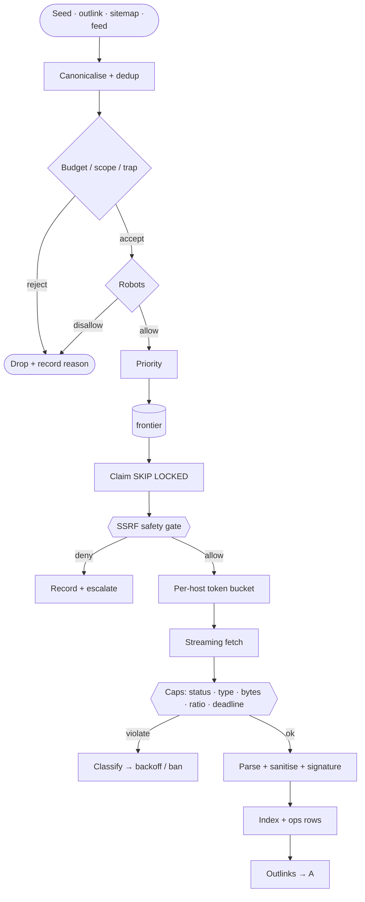

# Crawler — LYNX

The crawler is the part of LYNX that touches hostile input. Everything here is a security
control as much as a throughput mechanism.



## Documents

| Document | Contents |
| -------- | -------- |
| [frontier.md](./frontier.md) | URL discovery, priority, dedup, scheduling, budgets, bans |
| [robots.md](./robots.md) | Fetching, parsing, caching, user-agent groups, crawl-delay, failure semantics |
| [downloader.md](./downloader.md) | HTTP client, streaming, caps, compression, retries, backoff, backoff policy |
| [parser.md](./parser.md) | HTML → text/links/metadata, limits, sanitisation, fingerprints |
| [safety.md](./safety.md) | SSRF, blocked ranges, redirect validation, traps, decompression bombs |
| [politeness.md](./politeness.md) | Rate limiting, per-host budgets, `Retry-After`, backoff, abuse of origin |

Security-critical: [safety.md](./safety.md) and
[docs/security/ssrf-defense.md](../security/ssrf-defense.md) require two reviewers, fuzz
coverage, and the adversarial test suite in [tests/crawler](../../tests/crawler/README.md).

## Non-negotiables

| Rule | Where enforced |
| ---- | -------------- |
| Never open a socket to a private, loopback, link-local, or metadata address | `net.rs`, per hop |
| Never follow a redirect without re-validating the full URL | hand-rolled redirect loop |
| Never buffer an unbounded response | streaming with hard ceilings |
| Never send cookies, credentials, or referrers | no cookie jar exists |
| Never execute or render content | text extraction only |
| Never exceed a host's budget regardless of what robots says | budgets independent of robots |
| Never crawl in tests | fixture origin server only |

## Configuration

```toml
[crawler]
user_agent             = "LynxBot/0.1 (+https://anoneurx.com/lynx/bot)"
allowed_schemes        = ["http", "https"]
allowed_ports          = [80, 443]
max_redirects          = 5
max_depth              = 20
max_response_bytes     = 5242880
max_decompression_ratio = 100
connect_timeout_ms     = 5000
header_timeout_ms      = 5000
read_idle_timeout_ms   = 5000
total_timeout_ms       = 15000

[crawler.budget]
max_pages_per_host_day   = 5000
max_bytes_per_host_day   = 5368709120
min_inter_request_ms    = 1000
max_concurrent_per_host  = 2
```

Full reference: [config/example.toml](../../config/example.toml).

## Design decisions worth knowing

1. **Robots is a policy input, not a trust input.** A site that says `Allow: /` gets no
   more budget than one that does not, and a site cannot use robots to buy politeness
   credit it has not earned. See [ADR-0020](../adr/0020-crawl-budget-policy.md).
2. **IP validation is authoritative, hostnames are not.** Every URL is resolved and every
   returned address checked, because DNS names lie and IP literals are encoded in creative
   ways. See [ADR-0012](../adr/0012-crawler-ssrf-defense.md).
3. **Redirects are re-validated, not followed.** Client libraries follow redirects
   transparently by default, which would skip the safety gate entirely. LYNX handles each
   hop itself.
4. **No JavaScript.** No headless browser. JavaScript-only pages yield thin content, which
   is an honest limitation rather than a security risk. See
   [ROADMAP non-goals](../../ROADMAP.md#what-is-explicitly-not-planned).
5. **Extracted text only, never raw HTML.** See
   [ADR-0016](../adr/0016-content-storage-policy.md).