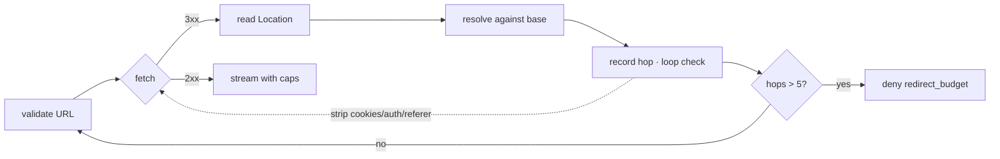

# Downloader

The component that turns a validated URL into bounded bytes. Every limit here exists
because a hostile server can be creative.

## HTTP client

| Setting | Value | Reason |
| ------- | ----- | ------ |
| TLS | rustls, TLS 1.2+ (1.3 preferred) | no OpenSSL dependency; consistent behaviour |
| HTTP versions | HTTP/1.1 and HTTP/2 | modern sites; HTTP/3 deferred |
| Cookies | **none** | no cookie jar exists in the process |
| Auth | none | no credentials are ever sent |
| Proxy | none by default | a proxy would undermine IP validation |
| Connection reuse | per host, pooled | politeness and latency |
| Decompression | automatic, **rate-limited** | gzip/br/zstd, ratio-capped |
| Redirects | **manual** | the client must not follow them; see [safety.md](./safety.md) |
| User agent | `LynxBot/…` | identity, per [robots.md](./robots.md) |

Redirect handling being manual is the important line. Any client that follows redirects
transparently will walk past the safety gate, and the safety gate is the entire SSRF
defence.

## Request discipline

```text
GET /path HTTP/1.1
Host: example.com:443
User-Agent: LynxBot/0.1 (+https://anoneurx.com/lynx/bot)
Accept: text/html,application/xhtml+xml,application/xml;q=0.9,text/plain;q=0.8
Accept-Encoding: gzip, br
Accept-Language: en;q=0.9,*;q=0.5          # some sites vary content by Accept-Language
Connection: keep-alive
```

We do **not** send: `Cookie`, `Authorization`, `Referer`, `Origin`, `X-Forwarded-For`, or
any LYNX-specific header. A crawler that identifies itself in a header invites sites to
serve it deliberately different content, which poisons the index with content no user would
ever see.

## Response validation

Checked in this order; the first failure classifies the attempt:

| Check | Rule | Classification |
| ----- | ---- | -------------- |
| Status | 2xx → proceed; 3xx → redirect handling; 408/429 → retry; 4xx → permanent; 5xx → retry | by class |
| Content type | allowlist: `text/html`, `application/xhtml+xml`, `text/plain`, `application/xml`, `text/xml`, `application/pdf` (deferred). `application/octet-stream`, `image/*`, `video/*`, `application/zip` → not indexed | `unsupported_content_type` |
| Content-Length | if present and > `max_response_bytes` → refuse **before reading** | `content_too_large` |
| Streaming bytes | abort the moment the observed total exceeds the cap, regardless of the header | `content_too_large` |
| Decompression ratio | observed `decompressed / compressed > max_decompression_ratio` → abort | `decompression_bomb` |
| Deadlines | connect, header, idle, and total, each enforced independently | `timeout_*` |
| Sniffing | no content sniffing for unlisted types; a `text/plain` body served as HTML is parsed as text | — |

The streaming cap is what makes the `Content-Length` check an optimisation rather than the
control. Servers lie about the length routinely; we count what actually arrives.

## Compression

```text
Accept-Encoding: gzip, br
decompression: streaming, ratio-tracked, abort on breach
max_ratio default 100:1     (a 5 MiB cap implies ≥ 50 KiB compressed)
```

Ratio is measured as observed decompressed bytes ÷ observed compressed bytes, updated
during the stream. A 1 KB response expanding to 1 GB is aborted after roughly 100 KB, not
after 1 GB of allocation.

## Redirects



- Budget 5. Each hop is fully re-validated (scheme, userinfo, port, host, resolved IP).
- DNS is pinned from the first hop; the address that was validated is the address we
  connect to.
- `Location` is resolved per RFC 3986, so `//host/path`, `/path`, and absolute URLs all
  work, and all of them get re-validated.
- A repeat URL in the hop chain is a loop → deny.
- Cross-scheme redirects stay inside `{http, https}`.

## Retries and backoff

| Class | Retry | Delay |
| ----- | ----- | ----- |
| `timeout_connect`, `dns_failure` | yes | 30 s ×2 with ±25 % jitter, cap 6 h |
| `timeout_headers`, `timeout_body` | yes | 60 s ×2 with jitter |
| `upstream_5xx` | yes | `Retry-After` if present, else 30 s ×2 with jitter |
| `upstream_429` | yes | **`Retry-After` mandatory**, host cooldown set |
| `http_4xx` | no | permanent |
| safety / budget / content limits | no | permanent, recorded |

Jitter is not cosmetic. Identical backoff across workers means a thundering herd against a
host that is already struggling, which turns a transient problem into a block.

Retry budget is global, not per-URL: a cap on retries per worker per minute, so a mass
failure cannot turn every worker into a spinning retry loop.

## Connection management

- Pool per host, capped (`max_idle_per_host`, default 2).
- `max_concurrent_per_host` = 2 in flight, enforced by the politeness layer.
- Idle connections closed on a TTL; `Connection: close` honoured when requested.
- A host that repeatedly accepts and hangs gets banned on the escalating schedule in
  [frontier.md](./frontier.md) rather than consuming connections forever.

## What we never do

- Never follow a redirect without re-validating.
- Never buffer the whole body before checking size.
- Never decompress without a ratio ceiling.
- Never send cookies or credentials.
- Never execute, render, or trust any part of the response.
- Never retry a permanent failure.
- Never retry without jitter.