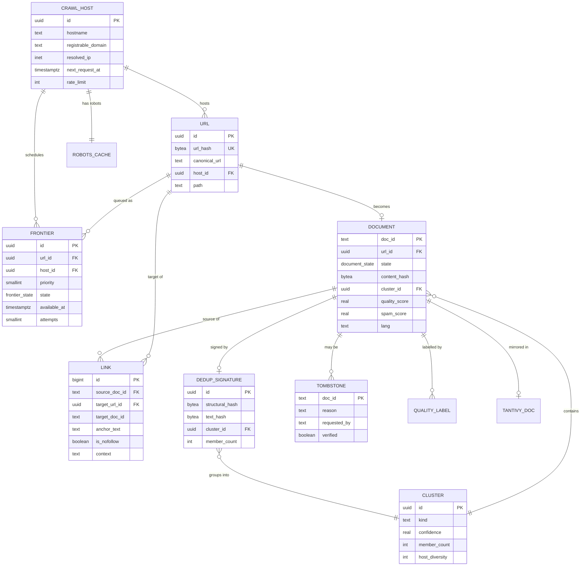
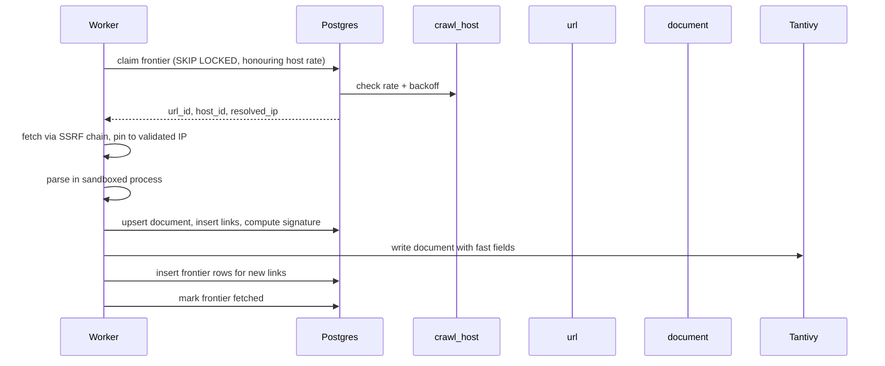
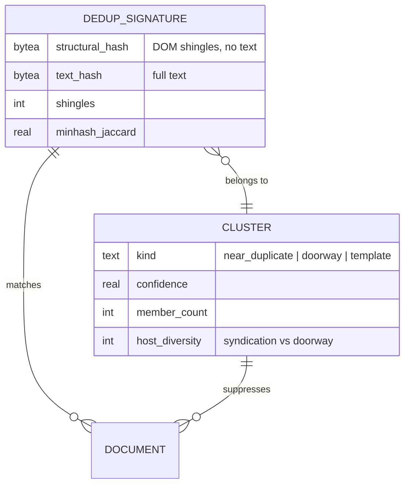
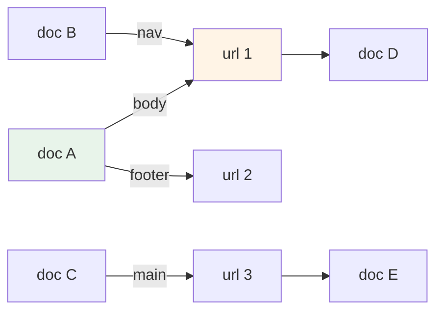
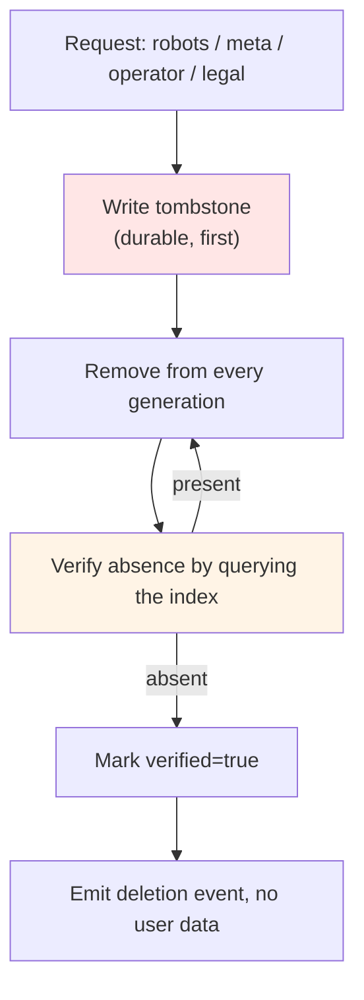

# Entity relationships



## The crawl pipeline in relations



Every step is idempotent by `doc_id` and `url_hash`. A worker that crashes after writing to
Tantivy but before updating Postgres re-fetches the URL, finds the content hash unchanged, and
skips the index write. That ordering — index first, then Postgres — means a crash leaves a
stale frontier row rather than an orphaned document, and the stale row is the harmless failure.

## Deduplication relationships



Two hashes, and the reason is the main subtlety in the whole model: a structural hash ignoring
text catches template farms; a text hash catches verbatim copies. One hash for both produces
false positives on legitimate templated sites and false negatives on paraphrased content.

`host_diversity` is what separates syndication from a doorway network. Fifty identical press
releases on fifty independent hosts is one document. Fifty near-identical landing pages with
interchanged local terms is a network, and the same structural signature describes both.

## Link graph



Link `context` decides whether an edge enters the authority graph:

| Context | In the graph? | Reason |
| ------- | ------------- | ------ |
| `main` | Yes | An editorial reference |
| `body` | Yes | An editorial reference |
| `nav` | No | Site navigation, present on every page |
| `footer` | No | Template, present on every page |
| Any, `is_nofollow` | No | The author asked us not to treat it as endorsement |
| Any, `is_sponsored` | No | Paid placement is not an editorial judgement |

Excluding nav and footer is not a refinement. If they were included, every site would link to
every other site through shared navigation, and PageRank would measure template overlap rather
than reputation.

## Deletion relationships



The ordering is the design. Tombstone before removal means a replayed crawl cannot resurrect the
document; verification after removal means a deletion is confirmed rather than requested.

## Cardinality rationale

| Relationship | Cardinality | Note |
| ------------- | ----------- | ---- |
| `crawl_host` → `url` | 1 : many | One host, many URLs |
| `url` → `document` | 1 : 0..1 | Not every URL is indexable |
| `document` → `link` | 1 : many | A document has many outlinks |
| `dedup_signature` → `document` | 1 : many | One signature, many members |
| `cluster` → `document` | 1 : many | A cluster suppresses its members |
| `document` → `tombstone` | 1 : 0..1 | A tombstone is unique per document |

`url` → `document` being 0..1 is worth noting: the majority of discovered URLs never become
documents, which is why `frontier` is the largest table and `document` is not.

## Cross-system consistency

```text
the same doc_id exists in Postgres and in Tantivy
Postgres is the label; Tantivy is the content
```

| Failure | Detection | Response |
| ------- | --------- | -------- |
| Document in Tantivy, absent in Postgres | Startup reconciliation job | Re-derive the row from the index |
| Document in Postgres, absent in Tantivy | Same job | Re-index |
| `doc_id` collision | Impossible with ULIDs; a UUIDv7 `url` id is not a doc id | n/a |
| Cluster id differs between systems | Cluster ids are stored as fast fields and compared | [RB-03](../../security/runbooks/index-corruption.md) |

Reconciliation runs on every new index generation rather than on a schedule, because a
generation swap is precisely when the two systems could have diverged.

## What is not modelled

| Not modelled | Why |
| ------------ | --- |
| Users | There are none |
| Queries | There are none |
| Sessions | There are none |
| Impressions | Not tracked |
| Clicks | Not tracked |

An ERD that omitted these would look incomplete against a conventional search engine's schema.
That absence is the schema, and it is the reason the privacy claims are verifiable rather than
aspirational.