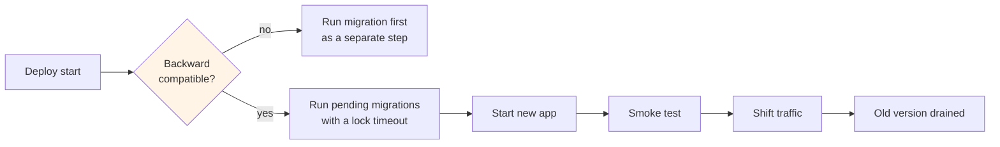

# Migrations

Migrations change the operational schema. The index schema changes separately, on its own
schedule, because index compatibility has different constraints.

## Naming

```text
NNNNNN_descriptive_snake_case
```

```text
000001_create_crawl_host
000002_create_url
000014_add_document_cluster_id
000031_backfill_dedup_signature
004002_indexer_widen_content_hash
```

The prefix `004` marks indexer-side migrations — migrations that touch the Tantivy writer
rather than Postgres. Both run in the same deploy, but only `000` migrations run against the
live database; indexer migrations run against the next generation's build.

## Rules

| Rule | Reason |
| ---- | ------ |
| Forward-only in production | A rollback path that depends on reversing data transformation is a path to data loss |
| One logical change per migration | A migration must be independently reviewable and independently attributable |
| Expand before contract | Add a column, backfill, switch reads, then drop. Never in one step |
| `IF NOT EXISTS` / `IF EXISTS` on every object | An idempotent migration is safe to retry, and deploys do retry |
| No `DROP` in the same release as its dependents | Two releases between add and drop |
| Every migration states its expected duration | A `ALTER TABLE` on a hot table can take an outage |
| Every migration is reviewed by a second person | Schema changes are permanent |
| Migrations never touch `analytics_result` or any user-facing behaviour | Privacy surface changes get an ADR |

The rule about no `DROP` in the same release as its dependents exists because a rollback of the
release that added the dependent would otherwise find the dependency already gone.

## The hot tables

`frontier` and `link` are large and hot. Rules:

```text
never ALTER TABLE on frontier without a plan
partition by month, so retention is DROP PARTITION rather than DELETE
new indexes are created CONCURRENTLY
adding a NOT NULL column uses a DEFAULT and a multi-step backfill
```

A `CREATE INDEX` on `link` without `CONCURRENTLY` locks writes and stalls the crawler. That is
the most common migration mistake in a system with a write-heavy table, so it is a review
checklist item rather than a convention.

## Expand–contract in practice

```sql
-- Release 1: expand
ALTER TABLE document ADD COLUMN cluster_id uuid REFERENCES cluster(id);
CREATE INDEX CONCURRENTLY document_cluster_idx ON document (cluster_id);

-- Release 2: backfill, in batches, outside a transaction
-- 50 000 rows per statement, with a sleep between batches
UPDATE document SET cluster_id = ... WHERE cluster_id IS NULL AND id IN (
  SELECT id FROM document WHERE cluster_id IS NULL LIMIT 50000
);

-- Release 3: switch reads to the new column, with the old path as a fallback

-- Release 4: contract
ALTER TABLE document DROP COLUMN old_column;
```

Four releases. The backfill in release 2 is deliberately unbatched-and-untimed on the
application side: a single 500-million-row `UPDATE` in one transaction holds locks and bloats
the table, so batching with a pause is required, not optional.

## Migrations at deploy time



| Step | Behaviour on failure |
| ---- | -------------------- |
| Migration | Abort the deploy; the previous version keeps running against the old schema |
| App start | Roll back; the schema is backward compatible by construction |
| Smoke test | Roll back automatically; traffic never saw the new version |
| Drain | Old version exits after in-flight requests complete |

Because every migration is backward compatible, a failed deploy leaves the previous version
running against a slightly newer schema, which is a state that is expected and therefore safe.

## Index migrations

Index schema is versioned separately:

```text
index schema version   bumped only for a change that requires a full rebuild
index generation       bumped for every commit, including a pure data addition
```

A generation bump is cheap. A version bump means a full rebuild, so it happens for structural
reasons only: a field type change, a tokenizer change, a new fused field, a scoring change in
the index itself. Anything else must be expressible as new data in the current version,
otherwise the cost of routine change is a rebuild.

## Validation

| Check | When |
| ----- | ---- |
| Migrate up on a snapshot of production | Every release |
| Migrate down on a scratch database | Every release, to prove reversibility exists even though production is forward-only |
| Estimate duration on production-sized data | Every migration touching `frontier`, `link`, or `document` |
| Check query plans for the claim query | Every release |
| Verify row counts match before and after | Every migration |

The duration estimate is the one that is most often skipped and most often needed. A migration
that takes 40 seconds on a laptop can take forty minutes on production data.

## Rollback

| Change type | Rollback |
| ----------- | -------- |
| Migration already applied | Do not reverse it; deploy the previous application version, which reads the old schema |
| New application version failing | Previous version, schema unchanged |
| Index generation failing | Previous generation; no migration involved |
| Data corruption | Restore from backup; this is why backups are verified weekly |

"Because the migration is forward-only, rollback means rolling back the app" is the entire
reason expand–contract is mandatory rather than preferred.

## Forbidden

| Forbidden | Consequence |
| --------- | ----------- |
| A migration that drops user-facing data without an ADR | Privacy surface change |
| A migration that writes a query into a column | There is no such column, and adding one is prohibited |
| A migration that runs unbounded | Deploy risk; every statement needs a bound |
| A migration that cannot be run twice | A deploy retry becomes an outage |
| Editing an applied migration | Environments diverge permanently; the file is part of the audit trail |

Editing an applied migration is the most tempting and most damaging. The history in `0001`
through `0007` is what every environment was built from, and changing it means no two
environments are the same, which is precisely the state migrations exist to prevent.