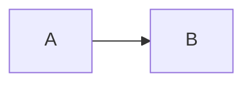

# Architecture Diagrams

All diagrams are **Mermaid** (`.mmd`) for version-controlled, reviewable docs.
Render in GitHub, VS Code (Markdown Preview Mermaid), or `mmdc` CLI.

| Diagram | File | Purpose |
| ------- | ---- | ------- |
| Data Flow | [data-flow.mmd](./data-flow.mmd) | Request lifecycle, component interactions |
| Threat Boundary | [threat-boundary.mmd](./threat-boundary.mmd) | Trust zones, data classification, attack surface |
| Deployment | [deployment.mmd](./deployment.mmd) | K8s topology, networking, storage |

## Conventions

- **Solid lines:** Synchronous request/response (gRPC, HTTP).
- **Dashed lines:** Async (Redis pub/sub, message queues).
- **Colors:**
  - 🔵 Blue = Search plane (read-only)
  - 🟢 Green = Crawl plane (write)
  - 🟠 Orange = Index plane (batch)
  - 🔴 Red = External / untrusted
- **Labels:** Protocol / payload / frequency.

## Rendering locally

```bash
# Install
npm install -g @mermaid-js/mermaid-cli

# Render all
for f in docs/diagrams/*.mmd; do
  mmdc -i "$f" -o "${f%.mmd}.svg" -b transparent
done
```

## Embedding in Markdown

```markdown

```

Or inline (GitHub renders automatically):

