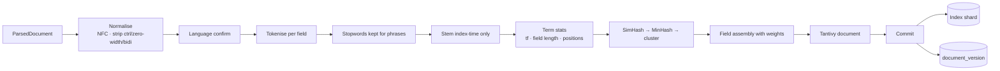

# Indexing — LYNX

Turning parsed documents into an index that retrieval can use efficiently and ranking can
reason about.



| Document | Contents |
| -------- | -------- |
| [pipeline.md](./pipeline.md) | Every stage, in order, with failure behaviour |
| [tokenization.md](./tokenization.md) | Unicode segmentation, normalisation, stopwords, stemming, per-language handling |
| [index-schema.md](./index-schema.md) | Fields, weights, analyzers, stored data, Tantivy mapping |
| [dedup.md](./dedup.md) | SimHash + MinHash, cluster assignment, canonical consolidation |

## Design principles

1. **One analysis pipeline, one tokenizer version.** Query-time analysis and index-time
   analysis must be identical, or nothing matches. The tokenizer version is recorded in the
   index manifest.
2. **Positions are stored** so phrase queries are exact rather than approximated by
   co-occurrence.
3. **Field lengths are stored per field** so BM25F can normalise each field separately.
   Without per-field lengths, a long body swamps a short title.
4. **Stemming is index-time only.** Queries are stemmed at query time with the same
   algorithm; stored terms are never stemmed twice.
5. **Stopwords are indexed but down-weighted**, not deleted, so phrase queries like
   "to be or not to be" work.
6. **Dedup is a demotion, not a deletion.** Near-duplicates stay searchable; they are
   suppressed from the top results and attributed to the original.
7. **The index is a derived artifact.** It can be rebuilt from the document store, which is
   why backups and disaster recovery treat it differently from Postgres.
8. **Document versions are immutable.** A re-crawl produces a new version; only the newest
   is indexed. This makes "what did we see last month" answerable and makes re-indexing
   idempotent.

## Determinism

Indexing is reproducible: the same input corpus with the same tokenizer version produces
the same index statistics. This is required for the quality gates to be meaningful — a
metric change must come from a ranking change, not from non-deterministic analysis.

```text
doc_id         uuid v7, derived from the canonical URL → re-crawls update in place
term_id        int32, dictionary-assigned per shard
posting        (term_id, doc_delta, tf per field, positions, field norm)
field lengths  per field, per document
cluster_id     uuid, from the dedup fingerprint
```

## Backpressure and commit policy

```text
commit every         commit_docs_threshold (20 000) docs
             or      commit_interval_seconds (30)
             or      on a manual flush
```

The indexer pauses consumption when the writer stalls or the frontier depth exceeds the
high-water mark. Indexing that outruns the writer produces a queue that grows without
bound, and the honest response is to slow down rather than to drop documents silently.

## Storage policy

We store extracted text, never raw HTML. Consequences:

- The copyright surface stays small — see [ADR-0016](../adr/0016-content-storage-policy.md).
- A parser bug or XSS in stored content cannot reach a user, because there is no stored
  markup to render.
- Snippets are generated from stored text and HTML-escaped at render time.
- Re-parsing after an indexer improvement requires re-fetching, not re-rendering stored
  HTML. That is a real cost and it is the accepted trade.

## What is not indexed

| Content | Why |
| ------- | --- |
| `noindex` pages | Site said not to |
| Non-HTML types | Out of scope for v0.1 (PDF deferred) |
| Documents below the quality floor | Thin/empty content would pollute results |
| Soft-404 pages | Detected via content similarity to the site's 404 pattern |
| Pages in a banned domain | Ban means ban, including the index |

Soft-404 detection deserves a note: sites return real 200 responses for nonexistent pages,
which would otherwise fill the index with duplicates of a template and swamp real results.
LYNX compares the extracted text signature against the site's own 404 signature and treats
a close match as a soft 404.

## Operations

| Metric | Meaning |
| ------ | ------- |
| `lynx_index_documents_total{action}` | written / updated / deleted |
| `lynx_index_commit_duration_seconds` | commit latency |
| `lynx_index_segments` | segment count (drives merge decisions) |
| `lynx_index_size_bytes` | on-disk size |
| `lynx_index_writer_queue_depth` | backpressure signal |
| `lynx_index_parse_errors_total` | documents that failed to index |
| `lynx_index_dedup_cluster_ratio` | share of documents in a duplicate cluster |
| `lynx_index_tokenizer_version` | label, so results are attributable to an analysis config |