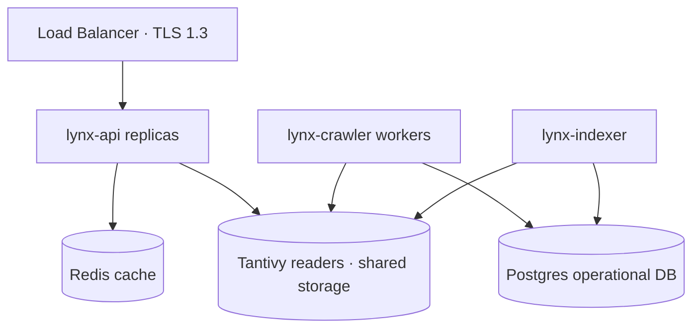

# Operations

Running LYNX in production: deployment, scaling, monitoring, and recovery.

| Document | Contents |
| -------- | -------- |
| [README.md](./README.md) | This overview |
| [deployment.md](./deployment.md) | Docker, Kubernetes, zero-downtime rolling updates |
| [scaling.md](./scaling.md) | Sharding, crawler workers, Postgres sizing |
| [monitoring.md](./monitoring.md) | Prometheus metrics, Grafana dashboards, alerting rules |
| [backup.md](./backup.md) | Postgres WAL archiving, Tantivy snapshot replication |

## Architecture in production

## Operational guarantees

1. **Zero-downtime deploys:** Search readers are hot-swapped atomically when a new index generation
   compiles.
2. **Read-only search plane:** Search replicas hold no mutable state, so scaling out is adding
   stateless containers behind a load balancer.
3. **No query logging:** Metrics capture request counts, latency, and error codes without query text.
4. **Independent planes:** Crawling and indexing failures cannot crash the search or API serving
   planes.