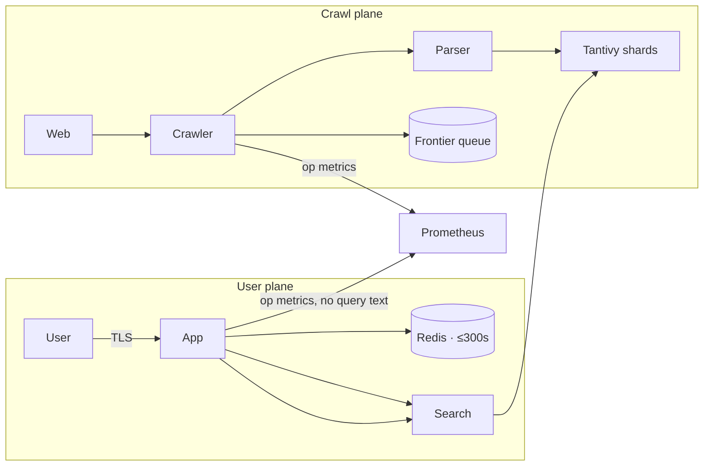

# Data flow and retention

Where data goes, how long it stays, and who can read it. The inventory is deliberately
exhaustive, because an undocumented data flow is an accidental retention policy.



## Inventory

| Data | Store | Encrypted | Retention | Access |
| ---- | ----- | --------- | --------- | ------- |
| Raw response headers | not stored | n/a | — | n/a |
| Raw HTML body | not stored | n/a | — | n/a |
| Parsed text blocks | Tantivy | at rest | index lifetime | search + crawler |
| Extracted links | Tantivy + Postgres | at rest | index lifetime | crawler |
| Crawl frontier state | Postgres | at rest | until dequeued | crawler |
| robots.txt | Redis + on-disk | no | 24 h, revalidated per spec | crawler |
| Rendered result payload | Redis | no | ≤ 300 s | search |
| Query plan (serialised) | Redis | no | ≤ 600 s | search |
| Completion dictionary | process memory | no | per generation | search |
| Crawl timing metrics | Prometheus | no | 30 d | operators |
| Ranked results, opt-in | Postgres | at rest | 30 d | operators |
| Error traces | Sentry-like self-hosted | in transit | 7 d | operators |
| Logs | structured stdout → journald | in transit | 7 d | operators |

## Retention rationale

| Choice | Rationale |
| ------ | --------- |
| Raw HTML discarded | Copyright and liability; see [privacy-model.md](./privacy-model.md) |
| Result cache 300 s | Long enough to absorb retries and near-simultaneous requests, short enough that a breach window is small |
| Query-plan cache 600 s | Planning is more expensive than retrieval; the longer TTL pays for itself |
| Frontier state indefinitely | The crawl queue is the product's engine; dropping it loses discovered URLs |
| robots.txt 24 h | Typical revalidation cadence; crawler honours the shorter of this and `Crawl-delay` |
| Prometheus 30 d | Enough to see a weekly pattern, short enough to bound exposure |
| Error traces 7 d | Enough to diagnose an incident, then gone |
| Ranked results 30 d | Enough to compare a ranking change across a month, then gone |

## Deletion

| What | How | Trigger |
| ---- | --- | -------- |
| Cache entries | TTL, `maxmemory` LRU | Automatic |
| Metrics | Prometheus retention | Automatic |
| Traces | Backend retention | Automatic |
| Ranked results (opt-in) | Scheduled job | Automatic at 30 d |
| A crawled document | Tombstone + Tantivy delete | Unindex request, ban, or legal request |
| All derived state for a domain | Cascade tombstone | Domain ban, `robots.txt` disallow discovered late |
| Legal erasure requests | [../security/incident-response.md](../security/incident-response.md) runbook | Human-authorised only |

Deletion is a **tombstone-then-delete** sequence rather than an immediate removal. The
tombstone carries the doc id, the deletion reason, and the timestamp, and it exists because
the failure mode of a distributed index is a resurrected document — and a resurrected document
for a deletion request is the worst bug this system could have.

```text
1  write the tombstone (doc_id, reason, requested_by, at)      — durable, first
2  remove from every live generation, including old ones        — idempotent
3  verify absence by querying the index                          — asserted in the runbook
4  emit a deletion event for monitoring                          — no user data in it
```

Verification at step 3 is what makes this trustworthy. A deletion that is not verified is a
deletion that has only been requested.

## Access control

| Role | Reads | Writes | Notes |
| ---- | ----- | ------ | ----- |
| `crawler` | frontier, robots cache | frontier, parsed docs, links | Separate credentials |
| `indexer` | parsed docs, links | Tantivy | No user-plane access |
| `search` | Tantivy, Redis | Redis (cache only) | Cannot write to Postgres |
| `operator` | metrics, aggregated stats | config via review | No direct database access in production |
| `developer` | none in production | none | Local development only |

The `search` service holding write access to Redis but not Postgres is the important one: it
can cache a query result, and it cannot write a query anywhere, because there is no write path
to anywhere durable.

## Backups

| Store | Backed up | Contains user data |
| ----- | --------- | ------------------ |
| Tantivy shards | Yes | No user data; public web content |
| Postgres | Yes | No user data; crawl state only, plus opt-in results |
| Redis | **No** | Discardable by design — every entry is derivable |

Not backing up Redis is a privacy decision as much as an operational one. A backup of the
cache is a backup of recently popular queries; because every entry is reconstructible, there
is no operational reason to keep one.

## Data that must never be created

Stated as an invariant that fails the build, not as guidance:

- a row, log line, metric label, or trace attribute containing a query string
- a cookie or storage entry identifying a user or a device
- an outbound request to a host not on the egress allowlist
- a stored raw HTML page
- a per-IP counter that outlives the request
- a user profile of any kind

## Audit

| Audit | Frequency | Method |
| ----- | --------- | ------ |
| Persistence-call audit of the search path | Every CI run | Static check plus a runtime test |
| Egress allowlist verification | Every CI run | Integration test against a deny-by-default proxy |
| Retention verification | Quarterly | Query each store for records older than its bound |
| Deletion verification sampling | Monthly | Sample 20 tombstones, assert absence from all generations |
| Data-flow diagram accuracy | Quarterly | Compare this document against the code paths |

Last verified: see [git history](../../).