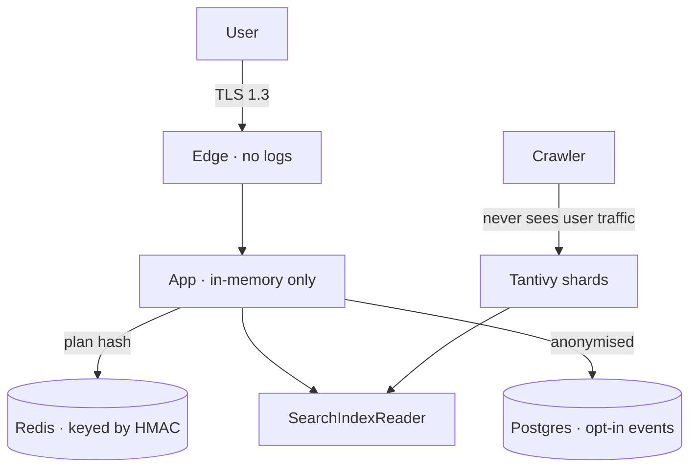

# Privacy model

The privacy model is a set of architectural constraints, not a policy statement. Every rule
here has a corresponding enforcement mechanism, because a promise without a mechanism is a
marketing page.



## The commitments

| # | Commitment | Enforcement |
| - | ---------- | ----------- |
| 1 | No query logging | No write path exists; type-level, tested |
| 2 | No cookies or local storage for identity | None set; no user model |
| 3 | No third-party assets | CSP with no external origins; build check |
| 4 | No third-party requests at all | Egress allowlist; no analytics, no fonts, no CDNs |
| 5 | No IP retention beyond the request | Not written; not logged by the edge |
| 6 | No user accounts in v0.1 | No authentication surface |
| 7 | No personalisation | No profile store |
| 8 | Crawler is separate from user traffic | Separate processes, separate networks |
| 9 | No raw HTML retention | Content discarded after parsing |
| 10 | No cross-site tracking | No cookies, no `localStorage`, no fingerprinting |

## 1. No query logging

The commitment is absolute, so the enforcement is structural rather than procedural.

```text
the search path has no INSERT, no file append, no metrics label containing query text,
and no span attribute containing query text
```

Consequences, accepted deliberately:

| Consequence | Assessment |
| ----------- | ---------- |
| No query analytics | We cannot know what users search. Search quality is judged on curated sets, not on live volume |
| Cannot detect outages by query volume | Monitor index health, latency, and error rates instead |
| Cannot personalise | No profiles exist |
| Debugging a user's bad result needs the plan they can see | `/explain` and the plan serialisation cover this without retention |
| Spam in the query box cannot be reported by users | Out of scope by commitment |

The last row is the one worth stating plainly: a search engine without query feedback is
missing the single most valuable signal in the industry, and LYNX accepts that loss rather
than the collection. That is the trade, and it is not free.

**Enforcement:** a CI check greps the search modules for persistence calls and a test asserts
that a scripted search writes nothing outside the HMAC-keyed cache.

## 2–4. No third parties

```text
Content-Security-Policy:
  default-src 'self';
  script-src 'self';
  style-src 'self';
  font-src 'self';
  img-src 'self' data:;
  connect-src 'self';
  frame-ancestors 'none';
  base-uri 'none';
  form-action 'self';
```

No `unsafe-inline` for scripts. No CDN for fonts or libraries — everything is served from the
same origin or inlined at build time. This is a CSP that would be painful to ship if third
parties mattered, which is the point.

**Enforcement:** a build-time test asserts every emitted asset URL is same-origin, and the
egress allowlist blocks anything outside the declared endpoints.

## 5. IP handling

The edge does not write access logs. Reverse-proxy logs are disabled; where an operator needs
operational metrics, they come from aggregate counters, not from per-request lines.

```text
no request line with a query string
no per-IP counters
no "user-agent → count" tables
```

Rate limiting is token-bucket by IP with a **bucketed** key: the bucket identifier is
`HMAC(ip, rotating_daily_salt)` and the salt rotates daily, so the bucket is not durable even
if the counter store were readable. Rate limiting needs to know "this caller", not "this
person".

## 6–8. No identity, no personalisation, separated crawler

No accounts means no identity to protect. No personalisation means no profile to leak. The
crawler runs as separate processes with separate network policy and never sees request
traffic — a compromise of the crawler cannot reach user data, and the user plane has no
outbound network path except to the search index.

## 9. No raw HTML retention

```text
fetch → decode → parse → extract → DISCARD the DOM
```

The parsed representation (text, links, metadata, structure) is stored. The HTML is not, and
neither is a compressed archive of it. Reasons, in order of weight:

| Reason | Consequence accepted |
| ------ | -------------------- |
| Raw HTML is a copyright and licensing problem | Cannot provide a "cached page" view. A huge feature loss |
| Raw HTML is a legal-liability surface | Cannot reproduce a page we no longer hold |
| Raw HTML at scale is expensive | Storage cost is lower |
| Minimising retention is a general principle | Fewer things to leak, fewer things to secure |

The consequence users notice most: **no cached pages**, so a dead link shows a dead link. That
is the honest behaviour, and an archived copy of someone else's site is not LYNX's to keep.

## 10. No cross-site tracking

No cookies, no `localStorage`, no fingerprinting, no canvas or font-based identification. The
only client-side state is the theme preference and the interface language, both in
`localStorage`, both non-identifying, both clearable from the UI.

## Data we do keep

Kept deliberately, minimally, and documented:

| Data | Where | Retention | Why |
| ---- | ----- | --------- | --- |
| Result payloads | Redis | ≤ 300 s, HMAC-keyed | Latency |
| Ranked anonymised results | Postgres | **Off by default**, opt-in | Aggregate quality measurement |
| Crawl state and links | Postgres | Indefinite | The index is the product |
| Public page count | Redis | Counter | Display only |
| Operational metrics | Prometheus | 30 d, no query text | Reliability |

The opt-in mechanism for the third row deserves attention: it is a config flag, off by
default, that stores the **results** of a query — which pages, ranked — and never the query
itself. Even when on, a query string can be reconstructed only if it is uniquely identifying,
so short, generic terms are excluded and only queries above a length threshold qualify.

## What is deliberately not done

| Not done | Reason |
| -------- | ------ |
| Privacy-preserving analytics of user behaviour | Any user-behaviour measurement is a re-identification risk even when hashed |
| Federated learning on queries | It transmits query-derived data, which is the thing we refuse to hold |
| Differential privacy noise on query counts | Adds complexity and a false sense of rigor over data we simply do not collect |
| Opt-out cookies, consent banners | Implies tracking exists |
| Anonymous accounts | An account is an identifier; removing the name does not remove the identity |

## Threat model summary

Adversaries considered and mitigated: see [../threat-model.md](../threat-model.md) for the
full analysis. The privacy-specific threats:

| Threat | Mitigation |
| ------ | ---------- |
| Server operator reading query logs | No logs exist |
| Log exfiltration via breach | No logs exist |
| CDN or analytics vendor observing queries | No third parties; egress allowlist |
| Analytics of repeated queries by a network observer | TLS 1.3, plus cache keys that reveal only plan equality |
| A user's history reconstructed from the cache | HMAC keys, no raw strings, TTL bounds |
| Fingerprinting to correlate users | No fingerprinting surface |
| Crawler compromise reaching user data | Separate processes and networks |
| Retention of page copies for later liability | Raw HTML discarded |

## Review

This document is reviewed whenever the request path changes. Any new field on the request
path, any new component making an outbound request, and any new persistence layer in the
search path requires updating this document first — a pull request that adds one without the
other is incomplete by definition.

| Review | Frequency |
| ------ | --------- |
| Full privacy model review | Quarterly |
| Data-flow diagram verification | Quarterly |
| New-data audit against this list | Every pull request |
| Threat model update | On any change to data flows |

Last reviewed: see [git history for this file](../../).