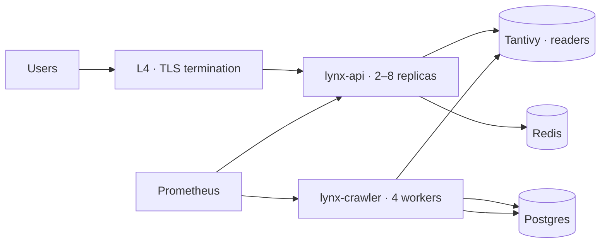

# Self-hosting

Running a LYNX instance is a supported path, and it is the path that keeps the privacy model
intact. This document covers what an operator takes on and how to avoid degrading the
commitments while doing it.

```text
self-hosted instance
  ├── own infrastructure, own traffic, own logs
  ├── same privacy commitments apply — they are code, not configuration
  └── the operator becomes the third party most likely to be careless
```

## What you get

| Component | What the operator provides |
| --------- | ------------------------- |
| Index | Built by their own crawler, over sites they choose to crawl |
| Search binary | The same `lynx-search` binary, same ranking, same defaults |
| API | The same endpoints and contracts |
| Configuration | Layered TOML, with privacy defaults that cannot be weakened silently |
| Upgrades | Semantic versioning, no forced migration without a documented path |

## What you take on

| Responsibility | Notes |
| -------------- | ----- |
| TLS certificates | Let's Encrypt automation, or bring your own |
| Running a crawler | Politeness, robots compliance, and blocklist maintenance are the operator's |
| Storage and backups | Index growth is roughly 15–25 % of corpus size per year |
| Capacity planning | Shards are independent; see [../operations/scaling.md](../operations/scaling.md) |
| Key management | See [../security/key-management.md](../security/key-management.md) |
| Legal obligations | In many jurisdictions, an operator is responsible for content it indexes |

That last row is the one operators underestimate. Running an index creates obligations —
copyright, defamation, data protection, consumer protection — that a hosted service provider
handles with a legal team. A self-hosted operator has themselves.

## Privacy defaults that cannot be weakened silently

These are enforced in the configuration loader, not by documentation:

| Setting | Default | Weakening requires |
| ------- | ------- | ------------------ |
| `query_logging.enabled` | `false` | Not available; no code path exists |
| `analytics.enabled` | `false` | Not available without a module that does not exist |
| `user_accounts.enabled` | `false` | Not available in v0.1 |
| `personalization.enabled` | `false` | Not available |
| `rate_limit.salt_rotation` | `24 h` | An explicit, logged configuration change |
| `result_cache.ttl` | `300 s` | An explicit, logged configuration change |
| `telemetry.export` | `none` | There is no export module |

```toml
[privacy]
query_logging        = false   # cannot be set to true; the loader rejects it
external_requests    = false   # cannot be set to true; the loader rejects it
third_party_assets   = false   # cannot be set to true; the loader rejects it
raw_html_retention   = false   # cannot be set to true; the loader rejects it
```

A loader that refuses `true` with a clear error is worth more than a comment saying please do
not do this. Configuration is where good intentions reliably lose to convenience, so the
loader removes the option.

## What an operator must not do

| Temptation | Why it is refused |
| ---------- | ----------------- |
| Add a query log for debugging | It is the one thing the design exists to prevent. Use `/explain` and ask the user for their plan |
| Put a CDN in front | It sees every query. It is also a third-party asset |
| Add analytics | Any user-behaviour measurement is a re-identification risk |
| Insert a custom ad or sponsored result | Breaks result purity; sponsored placement is a different product |
| Cache pages to serve them later | Copyright and liability, per [privacy-model.md](./privacy-model.md) |
| Rotate the crawler user agent to get past a block | A block is a decision |
| Feed results to a model provider | No external API calls exist |

The pattern: each of these is technically easy and would improve some metric. Each converts a
privacy architecture into a privacy policy.

## Operational transparency

A self-hosted operator is encouraged to publish, and the software makes it easy:

| Published artefact | Tooling provided |
| ------------------ | ----------------- |
| Own crawl rate | `lynx-crawl-rate` CLI and the public endpoint |
| Index size and document count | `lynx-status --json` |
| Uptime and latency | Prometheus metrics endpoint |
| Known issues | Standard issue tracker |

The intent is that an operator's users can verify claims rather than trust them. An operator
who chooses not to publish anything has still lost nothing technically — the metrics are
available locally — but has declined the auditability.

## Sizing

```text
corpus          1 M documents    ≈ 3 GiB  index, 8 GiB  working set, 2 vCPU
corpus          10 M documents   ≈ 30 GiB index, 48 GiB working set, 8 vCPU
crawl rate      default politeness  ≈ 30–60 requests/second/worker, 4 workers
ingest rate     sustainable       ≈ 15–25 M documents/year with 4 crawler workers
```



The crawler is the resource hog and the search plane is the latency-sensitive plane. Run them
on separate machines if you can, so a crawl spike cannot degrade query latency — the same
separation described in [../architecture/overview.md](../architecture/overview.md).

## Upgrades

| Version | Expectation |
| ------- | ----------- |
| Patch | No migration; drop-in restart |
| Minor | Configuration keys may be added; deprecated keys warn for one minor version |
| Major | A documented migration; the previous version stays runnable during a migration window |

Index generations are format-versioned and readable by the previous major version for one
release cycle, so an operator can roll back without a full rebuild. A rebuild is possible but
expensive, which is exactly why the compatibility window exists.

## Verifying an instance is running as documented

```bash
lynx-status --json | lynx-verify-privacy
```

```text
checks:
  query persistence        no write path reachable
  external requests        egress allowlist is deny-by-default
  third-party assets       CSP contains no external origins
  raw html storage         no store for HTML exists
  log configuration        no access log with query strings
  rate-limit salt age      within rotation window
  account surface          no authentication endpoints
```

`lynx-verify-privacy` is part of the release artefacts, so an operator does not have to audit
the source to check the commitments are holding. Verification that only the author can perform
is not verification.

## Related

- [privacy-model.md](./privacy-model.md) — the commitments
- [crawler-ethics.md](./crawler-ethics.md) — what you take on as a crawler operator
- [../security/](./) — securing the deployment
- [../operations/](../operations/) — running it