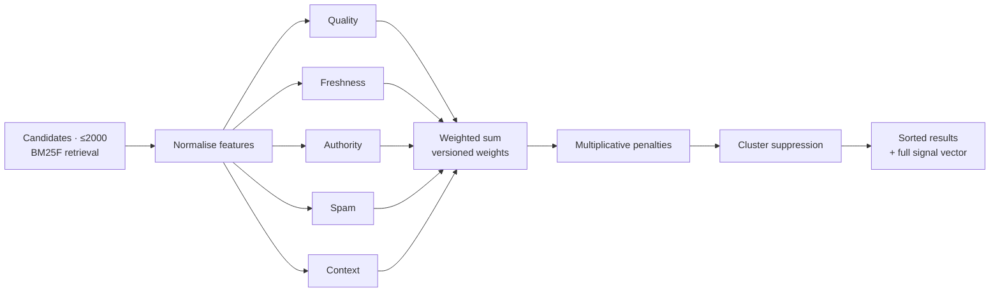

# Ranking — LYNX

Transparent, versioned, reproducible, explainable. The anti-goal is a black box.



| Document | Contents |
| -------- | -------- |
| [overview.md](./overview.md) | The pipeline, the aggregation formula, weight philosophy |
| [bm25f.md](./bm25f.md) | The lexical core, field weights, IDF, phrase, tuning |
| [freshness.md](./freshness.md) | Crawl and publication recency, decay curves, per-topic behaviour |
| [authority.md](./authority.md) | Link graph, PageRank, domain authority, capping, spam interaction |
| [quality.md](./quality.md) | On-page signals, what counts, what does not |
| [spam.md](./spam.md) | Spam signals, penalties, why penalties are multiplicative |
| [explainability.md](./explainability.md) | The explain contract, `/explain`, reproducible ranking |

## Principles

1. **Every signal is named, ranged, weighted, and tested.** A signal that cannot be
   explained cannot be fixed.
2. **Reproducible.** `(doc_id, index_generation, ranking_config_version)` determines the
   score. This is what makes a ranking complaint answerable.
3. **Additive for quality, multiplicative for harm.** Legitimate signals add; spam and
   penalties multiply, so a strong lexical match cannot rescue a spam page.
4. **Bounded.** Every signal is clamped to a declared range before weighting, so no feature
   bug can dominate the ranking.
5. **Retrieval and ranking are separate.** Retrieval is recall-oriented (BM25F); ranking is
   precision-oriented (signals). Conflating them makes tuning impossible.
6. **Versioned.** Weights live in config, not code. Changing one bumps the version, which is
   attached to every result.

## Aggregation

```text
lexical    = Σ_f  w_field(f) · bm25f_f(doc, query)
score_raw  =  lexical
           +  w_fresh   · freshness(doc, query)
           +  w_quality · quality(doc)
           +  w_auth    · authority(doc)
           +  w_context · context(doc, query)

score_pen  =  score_raw × (1 − clamp(spam(doc), 0, 1) · w_penalty)
score_final=  score_pen  × dup_penalty(cluster(doc))
```

Every term is clamped to [0, 1] (or [−1, 1] for features that can be negative) before it
enters the sum. `w_penalty` is the one weight with real leverage, and it is deliberately
the one most constrained by the quality gates: a change that tanks spam precision is visible
in the golden diff before it ships.

Weights live in `[ranking.signals]` in `config/`. The defaults:

```toml
[ranking.signals]
bm25         = 1.00   # the lexical scale, effectively the unit
freshness    = 0.18
quality      = 0.12
authority    = 0.15
context      = 0.10
spam_penalty = 0.40
```

## What is deliberately absent

| Not used | Why |
| -------- | --- |
| Click data | We do not have it, by policy |
| Personalisation | No profiles |
| Embedding similarity in v0.1 | Evaluated offline first; adds latency and unexplainability |
| Machine-learned ranking | Tested as a shadow model before it is ever trusted; must stay explainable |
| Query-term weighting from user frequency | Privacy model forbids it |
| Parent-domain inheritance of a subdomain's authority | A classic SEO vector |

Every one of these is a possible future addition, and each would need an ADR, an
explainability story, and a privacy review. "The incumbent does it" is not an argument.

## Evaluating changes

```text
any ranking change
  → bump ranking.config_version
  → regenerate golden snapshots; review the diff document by document
  → run the judged set: NDCG@10, Recall@50, MRR@10, duplicate rate, spam rate, freshness
  → run the performance budget (p95 latency, since more signals cost time)
  → the CI gate blocks on metric regression, not just test failure
```

Detailed procedure: [../testing/quality-evaluation.md](../testing/quality-evaluation.md).