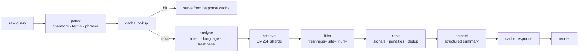

# Search — the query path

From a typed string to a ranked page. Everything here runs in the request path, so the
constraint that shapes all of it is latency: the budget is **p50 under 100 ms, p95 under
300 ms**, and a query is never delayed to wait for a slower answer.



| Document | Contents |
| -------- | -------- |
| [query-parsing.md](./query-parsing.md) | Operators, precedence, escaping, the parsed form |
| [query-planning.md](./query-planning.md) | Intent, language, stopwords, corrections, expansion |
| [retrieval.md](./retrieval.md) | Sharding, fusion, candidate budgets, failure behaviour |
| [snippets.md](./snippets.md) | Snippet and summary generation |
| [suggestions.md](./suggestions.md) | Autocomplete and related queries, built without logs |
| [cache.md](./cache.md) | What is cached, what is never cached, invalidation |

## Principles

1. **Operators are explicit.** If a user types `site:`, they mean it. No implicit filters
   beyond the small, documented set.
2. **Never log the query.** Not to disk, not to Redis, not in an error message. See
   [../privacy/privacy-model.md](../privacy/privacy-model.md).
3. **Degrade in a defined order.** Never return an error page; return fewer, worse results
   and say so.
4. **Every answer is explainable.** [../ranking/explainability.md](../ranking/explainability.md).
5. **Budgets are enforced in code**, not hoped for. A slow shard does not become everyone's
   p95.

## The latency budget

| Stage | p50 | p95 |
| ----- | --- | --- |
| Parse + analyse | 1 ms | 5 ms |
| Cache lookup | 0.5 ms | 2 ms |
| Retrieval (parallel shards) | 25 ms | 90 ms |
| Filtering | 1 ms | 3 ms |
| Ranking | 4 ms | 12 ms |
| Snippet | 6 ms | 20 ms |
| Serialisation + network | 5 ms | 25 ms |
| **Total** | **~42 ms** | **~157 ms** |

p95 has headroom because the tail is dominated by shard latency variance and snippet
extraction on pathological documents, both of which are bounded — see
[retrieval.md](./retrieval.md).

## Request lifecycle

```text
1  receive        normalise whitespace, cap length at 512 bytes, reject empty
2  parse          operators, phrases, negative terms → QueryPlan
3  cache          Redis by canonical hash of the plan, not the raw string
4  analyse        intent class, language, time sensitivity (no I/O)
5  retrieve       parallel BM25F per shard, merge candidates (≤ 2000)
6  filter         live filters, evaluated in plan order
7  rank           signals → penalties → cluster suppression → top 10
8  snippet        per result, best-passage selection
9  cache          the rendered response, short TTL, keyed by generation
10 render         HTML or JSON, with the signal vector when requested
```

## Serving modes

| Mode | Behaviour |
| ---- | --------- |
| `application/json` | Full structured response, signal vector included |
| HTML (browser) | Server-rendered page, progressive enhancement, no client-side framework needed for first paint |
| Streaming (SSE) | Results stream as shards resolve; first results in ~40 ms |
| Batch | For the research evaluation harness, no cache, full instrumentation |

Streaming is the reason p50 is achievable at all: the user sees the first results while the
slower shards are still being queried, so the tail stops being a visible latency problem.

## Empty and error states

Never a blank page. Each state is explicit:

| State | Behaviour |
| ----- | --------- |
| No parseable terms | Suggestions, plus an explanation of what was understood |
| No matches | Stated plainly, with the suggestions panel and the filters that were active |
| Index unavailable | Static fallback page with a status notice; no error exposed to the user |
| A shard timed out | Results from healthy shards, ranked, with a degraded-mode notice |
| Query too long | Truncated at a term boundary with a visible notice |

## What this layer cannot do

| Limit | Reason |
| ----- | ------ |
| No query logging | Privacy commitment; [../privacy/privacy-model.md](../privacy/privacy-model.md) |
| No personalised ranking | No profiles |
| No real-time results | Index freshness is bounded by crawl cadence, and a result that arrives before it is trustworthy is worse than a result that is a few hours late |
| No "search as you type" ranking | Typeahead uses [suggestions.md](./suggestions.md), which is prefix retrieval with popularity priors — not the ranking function |

That last row is a deliberate distinction: suggestions and results are different systems with
different guarantees, and conflating them would make the typeahead slow and the ranking
explainable-by-accident.