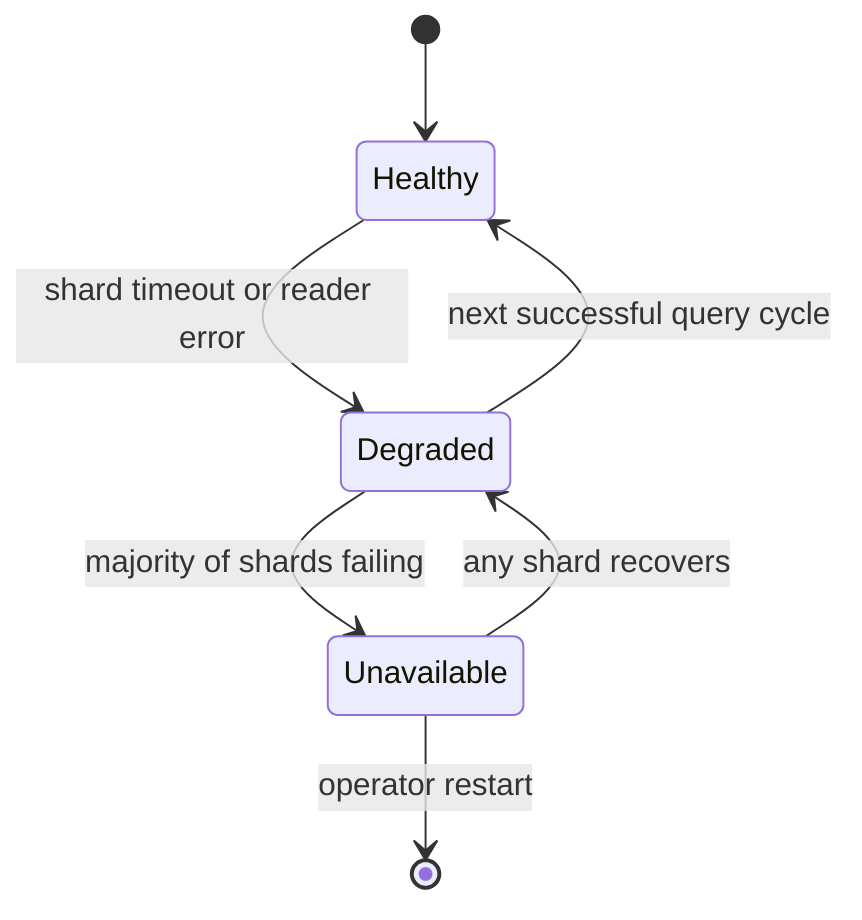

# Retrieval

Retrieval selects the candidate set that ranking then judges. The division of labour matters:
retrieval is recall-oriented and cheap, ranking is precision-oriented and strict. A miss is
always attributable to one or the other, never to both.

```text
QueryPlan ──▶ shard selection ──▶ parallel BM25F ──▶ merge ──▶ ≤ 2000 candidates
                                          │
                                          └── healthy / degraded / unavailable
```

## Sharding

```text
shard_key = language × content_type × index partition
```

Partitioning by language is not an optimisation, it is a correctness requirement: searching
English stemming and stopwords across a Japanese shard would be meaningless. Content-type
partitioning separates reference material from news, which lets freshness half-lives and
quality priors differ per shard without cross-contamination.

Shards are independent Tantivy directories, each with its own reader, committed snapshot,
and statistics. A query plans to a shard set, dispatches in parallel, and merges. Most queries
hit 1–3 shards; the fan-out is bounded at 12 with a per-shard deadline.

## Dispatch and deadlines

```rust
struct ShardDispatch {
    deadline:     Duration,     // 80 ms default, from the p95 budget
    max_candidates: usize,      // 800 per shard
    shard_count:  u8,           // ≤ 12
}
```

```text
total =  min(merged_candidates, 2000)

merge rule:  sort by (score, doc_id) descending
             doc_id is the tiebreaker so merges are deterministic
```

Per-shard deadlines with an early-success short-circuit: as soon as enough candidates have
arrived to satisfy the ranking budget, remaining shards are abandoned. The result is
deterministic in score, not in arrival order, so abandoned shards change the candidate set
only by removing tail candidates that would not have ranked anyway.

## Fused retrieval

Each shard performs one BM25F query across all fused fields
([../ranking/bm25f.md](../ranking/bm25f.md)) rather than one query per field. This matters
for correctness of the ranking signal as well as speed: per-field queries with independent
score merging is not BM25F, and the weights would not mean what
[bm25f.md](./bm25f.md) says they mean.

Field-specific behaviours that do require separate handling:

| Case | Handling |
| ---- | -------- |
| `intitle:` | separate term query, weighted into the plan |
| `inurl:` | separate term query on the url field only |
| `ext:` / `filetype:` | post-filter; no index-time partition for MIME types |
| phrases | separate phrase query with its own clause; positions already stored |
| `should` clauses | run independently and merged, so a document matching any `should` survives |
| stopwords | included with weight 0.15 |

## Failure behaviour

The rule is that a degraded index produces fewer results and a notice, never an error page and
never a hang.

| Failure | Behaviour |
| ------- | --------- |
| A shard times out | Abandon it; rank what arrived; attach a degraded notice |
| A shard is closed for indexing | Ignore it; the previous reader stays open |
| A shard is corrupt | Excluded by the health check; degraded notice; alert |
| All shards unavailable | Static fallback page with a status link; HTTP 200 with a visible notice |
| Field dictionary unavailable | Fall back to single-field `body` retrieval, notice attached |
| Out of memory | Bounded candidate count already prevents this; the cap is a hard invariant |



Degradation is a state machine, not an ad-hoc branch, because the alternative is a bug where
one failed shard produces a wrong answer instead of a partial one. The notice is part of the
contract: silently returning partial results would misrepresent our coverage, which is a form
of dishonesty we care about more than a slightly worse page.

## Candidate budget

```text
2000 candidates → 2000 ranked → 10 served
```

The budget is a hard cap, not a target. Ranking 2000 candidates with six signals and cluster
suppression is bounded and fast (see the latency budget in [README.md](./README.md)), and the
cap is what makes that true. Raising it is a performance change with a benchmark, not a
tuning knob.

Candidates are dropped lowest-score-first before ranking, so the cap costs recall on the tail
and nothing on the head. That trade is deliberate: the tail of 2000 candidates contains
almost nothing that ranks in the top 10.

## Index generation

Every reader is opened against a committed generation. A query therefore sees one consistent
snapshot: no generation switching mid-query, no partial writes, and a stable `doc_id → score`
mapping for explain output. A new generation is built alongside the old one and swapped
atomically; the old generation stays open until in-flight queries finish.

## Testing

- Property tests: merge order is independent of arrival order; the tiebreaker makes
  equal-score results stable across runs; the candidate cap is never exceeded.
- Failure-injection tests: kill a shard mid-query, corrupt a reader, close a shard during
  dispatch — asserting degraded mode with a notice, never a 500 and never a hang.
- A test that all shards unavailable produces the fallback page and a 200.
- Benchmark: candidate counts from 200 to 2000, asserting ranking latency stays inside the
  budget at the cap.
- A determinism test: the same plan against the same generation yields an identical candidate
  list, independent of shard latency ordering.