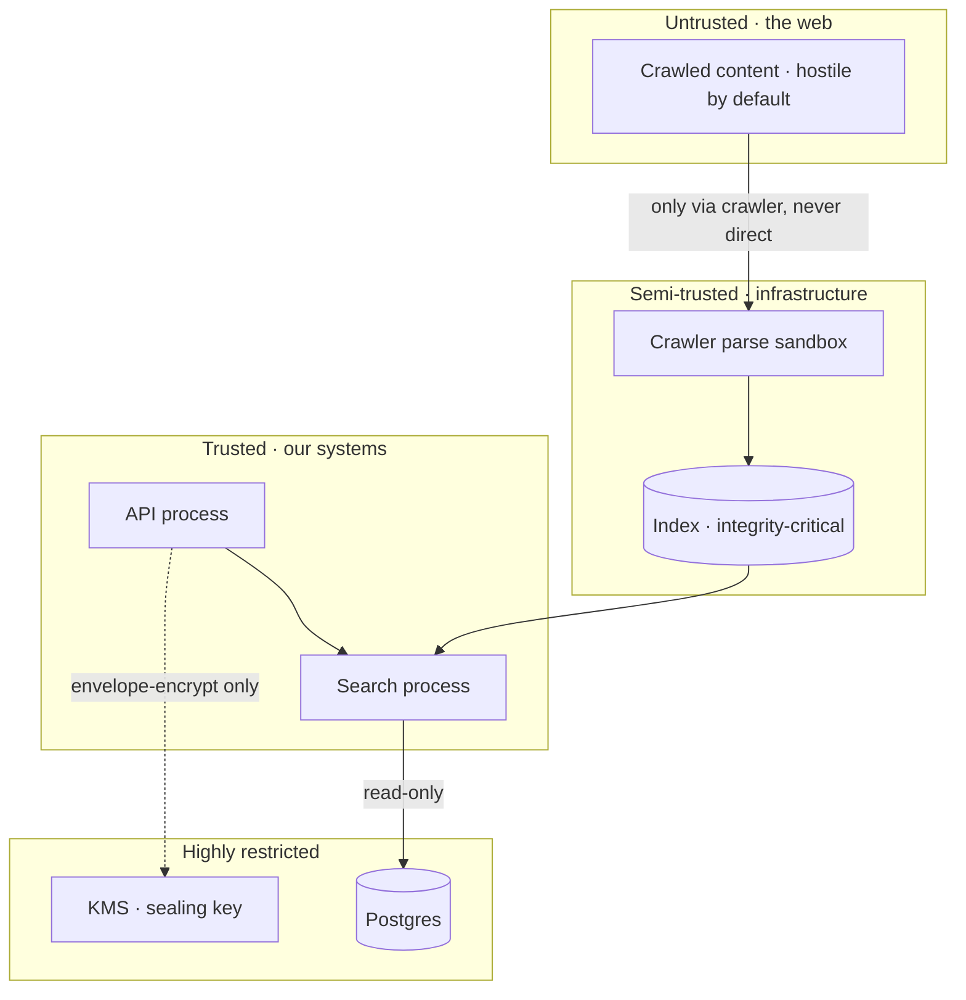

# Security — implementation of the security properties

| Document | Contents |
| -------- | -------- |
| [../threat-model.md](../threat-model.md) | Adversaries, trust boundaries, mitigations (authoritative) |
| [key-management.md](./key-management.md) | Secrets, KMS envelope encryption, rotation, HMAC keys |
| [sandboxing.md](./sandboxing.md) | Process isolation, seccomp, memory and CPU limits, no-network parsing |
| [ssrf-protection.md](./ssrf-protection.md) | The cross-cutting SSRF view: edge, crawler, AI, redirects |
| [secure-development.md](./secure-development.md) | Dependency pinning, fuzzing, supply chain, review, CI gates |
| [incident-response.md](./incident-response.md) | Runbooks, on-call, disclosure, postmortems |

## Threat summary

| Adversary | Capability assumed | Primary mitigation |
| --------- | ------------------ | ----------------- |
| Network attacker | Position on the path, reads TLS handshake | TLS 1.3, HSTS, no downgrade |
| Rogue operator | Production read access to metrics and config | No user data exists to read; no query logs; [key-management.md](./key-management.md) |
| Malicious web content | Full control of a crawled page's HTML, CSS, JS, headers, robots.txt | [sandboxing.md](./sandboxing.md), no JS execution, content-type gating |
| Malicious site operator | Controls DNS and redirects for a crawled host | [ssrf-protection.md](./ssrf-protection.md) |
| Supply-chain attacker | Compromises a dependency or the build | Pinning, provenance, [secure-development.md](./secure-development.md) |
| AI prompt injector | Plants instructions in crawled content | [../ai/astra.md](../ai/astra.md), no tools, read-only retrieval, provenance marking |
| Local attacker | Physical or hypervisor access to a host | Encrypted disks, sealed secrets, no production shell access for developers |

## Trust boundaries

The boundary that matters most is between **TB0 and TB1**: everything from the web is hostile
input, and the crawler is the only component that touches it. There is no path from a crawled
page to the API or search processes, and the search processes never parse untrusted content.

## Non-negotiables

1. **No JavaScript execution, ever.** Not in the crawler, not anywhere. A script engine is a
   remote code execution surface with a document corpus pointed at it.
2. **No shell.** No `sh -c`, no `Command::new` on input-derived strings, no template rendering
   with code evaluation. No exception is cheaper than the rule.
3. **No deserialisation of untrusted formats.** Structured parsing with explicit grammars:
   `serde` with `deny_unknown_fields`, `no_std`-style bounded parsing, no `pickle`-equivalent.
4. **No SQL string interpolation.** Parameterised queries only, enforced by a lint.
5. **Everything from the network is untrusted**, including our own shard responses.
6. **The index is integrity-critical.** Poisoning the index is a lasting attack, so index
   writes are restricted to the indexer process and verified.
7. **TLS 1.3**, with no fallback configuration available.

## The two properties worth stating twice

**Index integrity.** A compromised index cannot be detected by a user — it just returns wrong
answers, and a search engine that returns confident wrong answers is worse than one that
returns nothing. So: index writes come only from the indexer, from parsed content that passed
validation; index generations are content-verified against a manifest; and any field that can
influence ranking or is rendered to a user passes through escaping at write time and again at
read time.

**No identity means no identity theft.** There are no accounts, so there is nothing to
phish, no session to steal, and no credential database. This is the single largest reduction in
attack surface available to any web application, and it comes free from the privacy model
rather than being bolted on.

## Vulnerability handling

| Stage | Target |
| ----- | ------ |
| Acknowledge a report | 24 hours |
| Triage and severity | 72 hours |
| Fix for critical/high | 7 days |
| Fix for medium | 30 days |
| Disclosure | Coordinated, 90 days after a fix ships |

Reporting: [SECURITY.md](../../SECURITY.md). Submissions are encrypted to the maintainer key
published in that file. No safe-harbour enforcement against good-faith researchers, stated in
advance so that disclosure is safe.

## What is not defended

Stated so the gaps are known rather than assumed away:

| Not defended | Assessment |
| ------------ | ---------- |
| Zero-day in a dependency | Mitigated by minimal dependencies, pinning, and rapid updates; not eliminated |
| A malicious operator with KMS access | They could read secrets. Mitigated by audit logs and separation of duties; not eliminated |
| Physical access to unencrypted memory | Requires memory encryption, which conflicts with performance. Accepted, with the disk encrypted |
| Denial of service at scale | Rate limits, WAF, and CDN absorb ordinary abuse. A large-scale attack is a capacity problem |
| Poisoning that is indistinguishable from reality | A site publishing misleading content about itself is a content problem, not a security one |

## Related

- [../privacy/](../privacy/) — what we do not hold, which removes most of what could leak
- [../crawler/safety.md](../crawler/safety.md) — the crawler's SSRF and resource defence
- [../ai/astra.md](../ai/astra.md) — prompt injection and tool-use restrictions
- [../operations/](../operations/) — running it safely in production