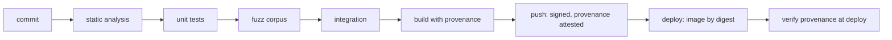

# Secure development lifecycle

How a dependency or a bad commit reaches production, and what stops it. The pipeline is
designed so that skipping a gate requires either editing the pipeline or forging a signature —
not merely forgetting a step.

## Dependency policy

| Policy | Rule |
| ------ | ---- |
| Version pinning | Exact versions in lockfiles; no ranges in committed manifests |
| Lockfile enforcement | CI verifies the lockfile is unchanged after a build; a drift fails |
| Minimal dependencies | Every dependency needs a written justification; "it was already there" is not one |
| Advisory policy | `cargo audit` and `npm audit` in CI; critical/high blocks a merge |
| Licence policy | Permissive only; AGPL and SSPL rejected; reviewed per dependency |
| Freshness | Automated dependency updates weekly, in a PR, never auto-merged |
| Alternative evaluation | A standard-library implementation is preferred over a dependency whenever the standard library is adequate |

The licence rule is worth stating plainly: a search engine that aggregates the web cannot
carry a copyleft dependency whose obligations conflict with how the index is distributed.
Dependencies are a legal decision as much as an engineering one.



## Static analysis gates

| Gate | Tool | Blocks on |
| ----- | ---- | --------- |
| Clippy | `clippy --all-targets -- -D warnings` | Any warning |
| Formatting | `rustfmt --check` | Any diff |
| Unsafe policy | custom lint | `unsafe` in parse code without a `SAFETY` comment |
| SQL safety | custom lint | String interpolation into a query |
| Shell safety | custom lint | `Command::new` with a non-literal |
| Debug-print lint | `clippy::print_stdout` in library code | `println!` outside a binary entry point |
| Secret lint | `Debug` on secret-bearing types | Missing `Debug` implementation |
| TypeScript | `tsc --noEmit --strict` | Any error |
| Dependencies | `cargo deny`, `cargo audit`, `npm audit` | Advisory, licence, or duplicate violation |
| Container | Trivy, Grype | CVE above the threshold in a shipped image |
| IaC | Checkov, tfsec | A misconfiguration above severity |

The unsafe-in-parse-code lint is the one that carries the most weight. Parser code is where a
memory-safety bug becomes remote code execution, so `unsafe` is denied there by tooling rather
than by review culture.

## Testing gates

| Gate | Requirement | Rationale |
| ---- | ----------- | --------- |
| Unit tests | All new logic | Baseline |
| Property tests | Parsing, ranking, robots matching, dedup | The invariant-shaped code |
| Fuzzing | Continuous, 24 h per PR target on parser targets | Parser bugs are found by fuzzing or not at all |
| Integration tests | All HTTP contracts, DB interactions | Contract regressions |
| Coverage | No decrease on changed lines | Prevents silent untested growth |
| Race detector | `cargo test -- --test-threads` plus a nightly TSAN job | Concurrency defects |
| Miri | Nightly on pure-Rust modules | Undefined behaviour in safe code |
| Golden ranking | Reviewed per-document diff | A ranking change is a user-visible change |
| Privacy tests | The query-persistence assertion, egress test | The commitments must be verified, not asserted |
| Performance | Latency budget tests | A regression must fail a build |

Fuzzing runs continuously against the parser with a corpus seeded from real crawled pages. Real
HTML is the input distribution that matters, and a synthetic grammar will not find the bugs that
real sites trigger.

## Supply chain

| Control | Detail |
| ------- | ------ |
| Lockfiles | Committed, verified unchanged after resolution |
| Build provenance | SLSA provenance attested at build time |
| Image signing | Cosign, keyless, signed by OIDC identity |
| Deployment by digest | `image@sha256:…`, never a tag, so the running image is exactly the built one |
| Provenance verified | The deployer verifies the signature and the provenance before pulling |
| Reproducible builds | Deterministic within a toolchain version; the digest is stable |
| Base images | Pinned by digest; minimal, no package manager left installed |
| No secrets at build time | Build sees no production credential |
| Release artifacts | `cargo sbom` and a CycloneDX SBOM published with each release |
| Reproducible verification | A public command anyone can run to confirm an artefact matches its source |

Provenance verification at deploy time is what makes the rest useful. An unsigned artefact is
only as trustworthy as the network that delivered it.

## Review requirements

| Change | Reviews required |
| ------ | ---------------- |
| Normal change | One reviewer |
| Dependency addition | One reviewer plus a licence justification |
| Parser or network code | One reviewer, one security reviewer |
| Authentication, crypto, secrets | Two security reviewers |
| Privacy model change | Two reviewers, one must be a maintainer |
| CI or pipeline change | Two reviewers |
| Anything touching the request path | Two reviewers, at least one privacy-aware |

The last rule is deliberate: the request path is where the privacy commitments live, and it is
the path with the least test coverage of intent.

Reviewers are responsible for the checklist, not the diff:

- does this collect data? if so, is it in the inventory?
- does this add an outbound request? if so, is it on the egress allowlist?
- does this parse untrusted input? if so, is it bounded?
- does this add a configuration key? is the default the safe one?
- does this change a ranking weight? where is the golden diff?
- is there a way to test this that would fail if the intent regressed?

## Secrets in the repository

| Rule | Enforcement |
| ---- | ----------- |
| No credential ever committed | Pre-commit secret scan plus a full-history scan |
| No sample keys that resemble real keys | CI pattern match against provider key formats |
| Test fixtures use obviously fake values | `test-key-NOT-A-REAL-KEY` pattern, asserted |
| `.env` never committed | `.gitignore` plus a CI check |
| Findings are remediated in history | History rewrite plus a rotation, never just a file deletion |

Deleting a committed secret is not remediation. Rotation is what makes it a secret again, and
history rewrite is what stops it being reused by anyone who cloned the repository.

## Vulnerability intake

```text
report       SECURITY.md, encrypted to the published maintainer key
triage       24 h acknowledge, 72 h severity
critical     fix within 7 days, expedited release, advisory published
high         fix within 30 days
disclosure   coordinated, 90 days after the fix, or immediately for active exploitation
safe harbour good-faith research is explicitly protected, stated in advance
```

Publishing an advisory means describing the vulnerability, the affected versions, the fix, and
the detection guidance. An advisory that does not say how to detect compromise is only half
useful.

## Dependency update policy

Automated updates open a pull request weekly and are never auto-merged. High-severity advisories
get an expedited pull request with a 24-hour review expectation. The policy is deliberately
unambiguous on one point: **an upgrade is a change requiring review**, because that is how a
supply-chain attack enters.

## Per-release checklist

```text
[ ] cargo audit, cargo deny, npm audit clean
[ ] all gates green on the release commit
[ ] fuzzing run for the target duration with no new findings
[ ] SBOM generated and published
[ ] container scanned, no CVE above threshold
[ ] image signed, provenance attested, deployed by digest
[ ] privacy tests green (query persistence, egress allowlist, CSP)
[ ] golden ranking diff reviewed
[ ] secrets exposure check clean (expose() call sites reviewed)
[ ] CHANGELOG updated, version bumped, signed tag
```

## Related

- [../threat-model.md](../threat-model.md) — what these controls address
- [key-management.md](./key-management.md) — secrets at runtime
- [../crawler/safety.md](../crawler/safety.md) — untrusted input defence
- [../testing/](../testing/) — the test strategy this implements