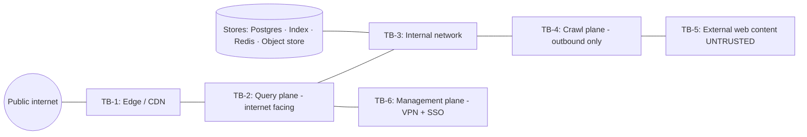

# LYNX Threat Model

> Scope: LYNX as designed in [ARCHITECTURE.md](./architecture.md). Every threat lists
> impact, likelihood, mitigation, and **residual risk**. LYNX does not claim to eliminate
> threats; it claims to have priced them.

## 1. Method

STRIDE for the technical surface, plus a privacy-specific pass, plus an abuse pass.
Assets ranked:

| Rank | Asset | Why |
| ---- | ----- | --- |
| A1 | Query data (in transit, in memory) | Most damaging if persisted or leaked |
| A2 | Signing keys, API key hashes, DB credentials | Full compromise of a plane |
| A3 | Crawl plane hosts | Outbound fetch capability = SSRF primitive if abused |
| A4 | Search index | Integrity loss destroys trust in results |
| A5 | Ranking config | Subtle integrity loss (biased results) |
| A6 | Crawled text corpus | Third-party copyright + personal data exposure |
| A7 | Availability of search | Primary user-facing function |
| A8 | Takedown/abuse records | Legal exposure if leaked or ignored |

Trust boundaries:

Adversaries modelled:

- **A-EXT** remote attacker, no credentials, high volume capability.
- **A-DEV** developer with a valid LYNX API key, trying to exceed quota or enumerate index.
- **A-SITE** malicious website owner controlling content LYNX crawls.
- **A-INS** insider (operator/admin) with legitimate infrastructure access.
- **A-EXTL** hosting/network provider, compelled or negligent access to logs.
- **A-HOST** compromised third-party dependency (crate, npm package, container base image).

---

## 2. External attacker threats

| ID | Threat | Impact | Likelihood | Mitigation | Residual risk |
| -- | ------ | ------ | ---------- | ---------- | ------------- |
| T01 | API flooding / resource exhaustion (search endpoint) | A7: degraded or unavailable search | High | Per-prefix rotating buckets ([PRIVACY.md §4](#4-rate-limiting-without-identity)), global concurrency caps, cheap query-length/parse-cost ceilings, CDN edge shielding, autoscale with hard max | Sustained distributed flood from many prefixes costs money; we absorb it with a budget, not a fix |
| T02 | Crawler abuse via forged `Host`/absolute-URI/redirect to internal services | A3: internal network read | Medium | Full URL validation at **every hop**, DNS pinned to validated IP, blocked-CIDR deny set incl. `169.254.0.0/16` and `::1`, port allowlist, redirect budget of 5 ([docs/security/ssrf-defense.md](./security/ssrf-defense.md)) | DNS-based and application-layer proxies that LYNX cannot see; a compromised proxy would bypass all of it |
| T03 | Index poisoning via crafted content (hidden text, keyword stuffing, cloaking) | A4: bad results, degraded trust | High | Field-weight normalisation (body term frequency saturates), stuffing detector, cloaking detection by multi-identity re-crawl, quality/spam features with penalties, indexed-doc provenance for every doc, spot-audit tooling | Novel spam patterns always lag the detector; mitigation is ranking degradation, not elimination |
| T04 | Ranking manipulation via link farms / reciprocal link rings | A4/A5: artificial authority | Medium | PageRank with damping 0.85 and topic-neutral random teleport, per-domain authority cap, link quality features (out-degree entropy, reciprocity), sitecluster-style template similarity, external-link requirement for high-authority domains | Rings can evade graph heuristics; accepted, monitored via authority distribution drift alert |
| T05 | SQL injection in query or ops API | A2/A3/A4: data theft or corruption | Low | Parameterised access only, no string-built SQL anywhere, `sqlc`-generated typed queries, least-privilege DB role per service, stored procedures not used, integration tests with hostile input | Misconfiguration of DB grants |
| T06 | Injection into the AI layer (prompt injection from crawled pages) | A1/A4: fabricated or manipulated answers | Medium (once AI ships) | Content confined to an untrusted-data channel with explicit delimiters, instruction/data separation, injection-pattern detection, citation verification with fail-closed behaviour, no tools, no memory, model output schema validation, documented in [docs/ai/prompt-injection.md](./ai/prompt-injection.md) | Novel injection techniques; answer layer fails closed to plain results |
| T07 | Admin plane compromise | A2/A5: total control | Low | VPN-only + SSO + MFA, no public admin route, least privilege, audit trail, dual-control break-glass, config changes are code-reviewed | Insider with live prod access; mitigated by audit rather than prevention |
| T08 | API key theft and quota abuse | A7/cost | Medium | Keys stored as `sha256` hash, shown once, scoped, rotatable, per-key rate limit and hard monthly quota, last-used tracking, single-key kill switch, no key in URLs, keys never logged | Keys copied out of band by users |
| T09 | Path traversal / unsafe file handling in parser output | A6/A3: arbitrary file write | Low | No filesystem paths derived from remote data, streaming writes to content-addressed paths, path canonicalisation, container rootfs read-only, non-root user | Parser library bugs |
| T10 | API enumeration of index internals (doc ids, internal counts, term dictionary) | A4: reconnaissance | Medium | Opaque public doc ids, no term-dictionary endpoint, counts coarsened or cached only, internal endpoints require auth, response fields whitelisted by serde, no debug output in production | Existence of an indexed URL is public information by nature |
| T11 | Denial via pathological query (regex bomb, huge phrase, deep nesting) | A7 | Medium | Query length cap (512 bytes), token cap, nesting depth cap, no user-supplied regex in v1, parser fuzz-tested with `proptest`, per-request CPU budget | Pathological-but-legal queries inside the caps |

---

## 3. Malicious website threats (crawl plane)

| ID | Threat | Impact | Likelihood | Mitigation | Residual risk |
| -- | ------ | ------ | ---------- | ---------- | ------------- |
| T12 | Decompression bomb / zip-style expansion | A3/A7: memory exhaustion | Medium | Hard decompressed-byte ceiling enforced during streaming, ratio cap (default 100:1), hard response byte cap (default 5 MiB, configurable), `Content-Length` pre-check, timeout enforced mid-stream not just at connect | Server that trickles bytes below the deadline still consumes a worker slot until the total deadline |
| T13 | Infinite redirect chains / redirect loops | A3: worker starvation | High | Redirect budget 5, per-hop re-validation, loop detection on the hop chain, redirect contributes to the per-URL deadline | Chain within budget that burns time; mitigated by total deadline |
| T14 | Crawler trap (infinite URL space, session/param explosion) | A3/A7: budget waste | High | Depth cap, per-host page budget, per-host daily byte budget, URL canonicalisation (sorted deduped query params, tracking-param stripping), max-URLs-per-path, infite-space detection by param entropy | Traps that vary per request; accepted via host budgets |
| T15 | Slowloris / connection holding | A3: worker starvation | High | Connect timeout, header timeout, per-read idle timeout, total per-URL deadline, bounded concurrency per host, `rustls` session handling under our control | Slow enough to stay inside every deadline |
| T16 | Malicious HTML/JS/CSS payload delivery to users | A1/A7: user harm | Medium | We store extracted text only, never serve crawled bytes as HTML, results are link-only + our own snippet, strict `rel="noopener noreferrer nofollow"`, `referrerpolicy="no-referrer"`, no proxying of third-party content, CSP on our pages, snippet HTML-escaped and control-char stripped | Phishing pages still exist in results; mitigated with (optional, later) safe-search-style labelling and user reporting |
| T17 | Hostname/DNS tricks (rebinding, wildcard DNS, IDN homographs) | A3: bypass of host rules | Medium | IP-based policy is authoritative, DNS answer pinned for the connection, IDN punycode normalised and logged, confusable-label detection flags for display, no reliance on hostname matching for safety | Attacker-controlled resolver upstream |
| T18 | Poisoning via `robots.txt` abuse (allow-all to evade politeness measurement) | A4/A7: crawl inefficiency | Low | Robots is a policy input, never a trust input; crawl budgets are enforced independently of robots, and per-host politeness remains even with permissive robots | None material |

---

## 4. Infrastructure compromise

| ID | Threat | Impact | Likelihood | Mitigation | Residual risk |
| -- | ------ | ------ | ---------- | ---------- | ------------- |
| T19 | Postgres theft (dump) | A1/A6: exposure of crawled corpus and ops data | Low | No user PII in Postgres by design, encryption at rest, field-level encryption for abuse reports, column-level privileges per role, network-isolated DB, PITR backups to object store with server-side encryption, restore rehearsal | Backups are a second copy; both encrypted but both exist |
| T20 | Index tampering | A4: false results | Low | Index writes only by the indexer service account, index version counter, snapshot checksums, admin index operations require approval + audit, nightly index integrity verification against a sampled source-of-truth | Malicious insider |
| T21 | Secret leakage in repo or image | A2: plane compromise | Low | Pre-commit secret scanning, CI secret scan, secrets never in git (`.env` ignored), Docker build-time scan, `SOPS`/external secrets, image SBOM + Trivy, minimal base images, no production secrets in dev config | Leaked third-party credential upstream; documented review process |
| T22 | Supply-chain compromise of a Rust/npm dependency | A2/A3: arbitrary code execution in our binary | Medium | `cargo deny` (advisories + licences), `cargo audit`, pinned `Cargo.lock`, minimal dependency set with hand-review for anything touching the network/filesystem, npm audit + pnpm lockfile, Sigstore/cosign verification where available, reproducible builds, no build-time network fetches | Transitive dependency compromise |
| T23 | CI/CD pipeline compromise | A2: malicious deploy | Low | Protected branches, required reviews, CI runs on PRs from forks with no secrets, pinned action versions by SHA, no self-hosted runners for untrusted PRs, OIDC-based cloud auth instead of static keys | Upstream GitHub account compromise |
| T24 | Eavesdropping (network-level) | A1: query exposure | Medium | TLS 1.3 everywhere, HSTS + preload, no plaintext in production, mTLS or tunneled DB/Redis connections internally, no third-party proxies in the request path, documented in `/privacy` | Global passive observer sees metadata (SNI is encrypted under TLS 1.3 ECH in future work); national-level adversary out of scope |

---

## 5. Privacy threats

| ID | Threat | Impact | Likelihood | Mitigation | Residual risk |
| -- | ------ | ------ | ---------- | ---------- | ------------- |
| T25 | Query logging by LYNX | A1: profile reconstruction of sensitive interests | Low (by design) | No query text persistence anywhere; log writer redacts; CI test asserts no query string reaches the sink; metrics are shape-only; access to raw logs cannot reveal queries | Operational necessity may force a documented exception in future; that requires an ADR and a changelog entry |
| T26 | Query exposure to third parties (CDN, analytics, error tracking) | A1 | Low | First-party-only CSP, self-hosted fonts/assets, no third-party services on query path, `connect-src 'self'`, integration test on CSP | User's own browser/OS, VPN provider, or DNS resolver |
| T27 | Correlation attacks via coarse IP timing | A1: partial linkage | Medium | No stable identifier, daily salt rotation, no cross-request linkage, short retention, `Referrer-Policy: no-referrer`, no third-party assets to correlate against | Timing/pattern analysis at the network layer; out of scope, disclosed |
| T28 | Fingerprinting (browser characteristics, headers) | A1: pseudonymous tracking | Medium | We do not fingerprint, we do not store headers, no canvas/font probes, no cross-session ids, no device-specific storage, `Permissions-Policy` minimised, uniform CSP | User agent and TLS fingerprint still visible to our server per request; not stored, but observable in-flight |
| T29 | IP retention in infrastructure logs | A1: location + identity linkage | Medium | Edge access logs use path-only format with query string redaction, `geo`/UA fields disabled at the log pipeline, short retention (14 days), documented in ops runbook | Provider-level and OS-level logs outside our control; disclosed in limitations |
| T30 | Data subject request handling failure | Legal/compliance | Low | `takedown_request` + `abuse_report` tables are the only personal-data-bearing tables; erasure handled as URL purge or abuse-record purge; documented in [docs/privacy/legal.md](./privacy/legal.md) | Backups cannot be selectively purged within retention window (disclosed, 35-day max) |
| T31 | Secondary use of crawled corpus for unrelated profiling | A6/A1 | Low | Corpus stored as extracted text keyed to URL with explicit purpose "search indexing"; no user-centric joins are possible because no user data exists; corpus access limited to indexer | Insider misuse; mitigated by audit and least privilege |

---

## 6. Availability and physical threats

| ID | Threat | Impact | Likelihood | Mitigation | Residual risk |
| -- | ------ | ------ | ---------- | ---------- | ------------- |
| T32 | Region/zone outage | A7 | Low | Multi-AZ Postgres with automatic failover, index replica promotion, object-storage backups, tested RTO | Full-region outage; documented RTO |
| T33 | Disk exhaustion on index or queue | A7 | Medium | Disk alerts, index compaction job, queue backpressure, retention/purge jobs, admission control on frontier depth | Burst crawl can outpace compaction; backpressure covers it |
| T34 | Malicious takedown/abuse report flooding (legal DoS) | Legal/A7 | Low | Authenticated report path, rate-limited, human review required before action, bulk-report detection | Slow response to a genuine wave of takedowns; accepted |
| T35 | Physical seizure / hardware | All | Low | Encrypted volumes (unreadable), remote backups, key material in external secret store so seized disks are useless | Availability loss within RTO |

---

## 7. Explicitly out of scope

- Lawful-compulsion access by a state actor with infrastructure-level control.
- A zero-day in TLS, the Linux kernel, or the Rust compiler.
- Social engineering of LYNX maintainers for commit access (mitigated by 2FA + review, not eliminated).
- Defending against a state-scale adversary performing traffic analysis.
- 0-day in a browser rendering a LYNX result page.

---

## 8. Risk register and review cadence

| Risk | Appetite | Review trigger |
| ---- | -------- | -------------- |
| Index quality degradation | Medium | Monthly quality report; alert on NDCG@10 drop > 5% |
| Privacy model weakening | Zero | Any PR touching `privacy.*`, log writers, or CSP requires privacy review by a second maintainer |
| Crawler-induced outbound abuse | Low | Any SSRF-denial spike or abuse complaint |
| Supply-chain compromise | Low | Weekly automated scans; ad-hoc on new critical dependency |
| Cost blowout from crawling | Medium | Daily budget check; per-host byte budgets |

Review the full model every 6 months and after any incident, and record changes as ADRs.

## 9. Related

- [PRIVACY.md](../PRIVACY.md) — privacy commitments
- [docs/security/architecture.md](./security/architecture.md) — controls
- [docs/security/incident-response.md](./security/incident-response.md) — T07/T19/T21/T23 runbooks
- [docs/crawler/safety.md](./crawler/safety.md) — T02/T12/T13/T14/T15/T17 implementation notes